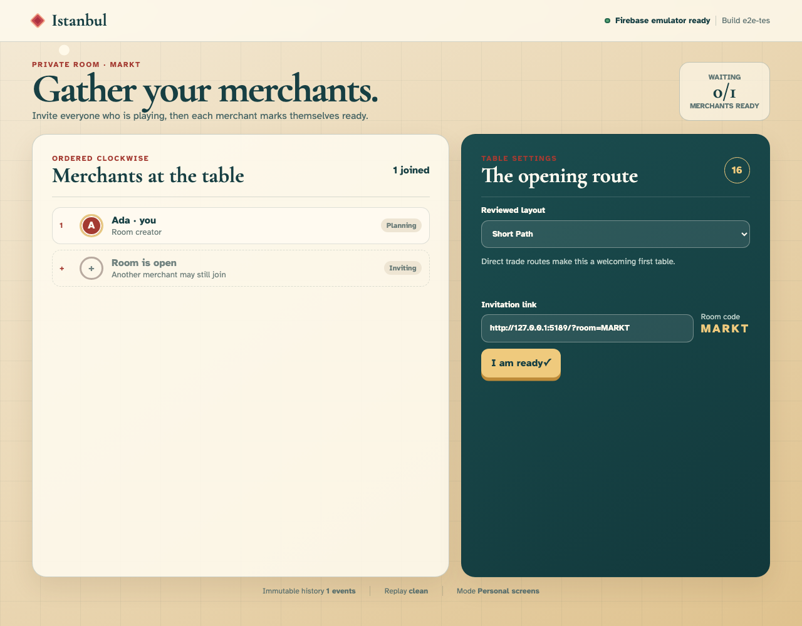
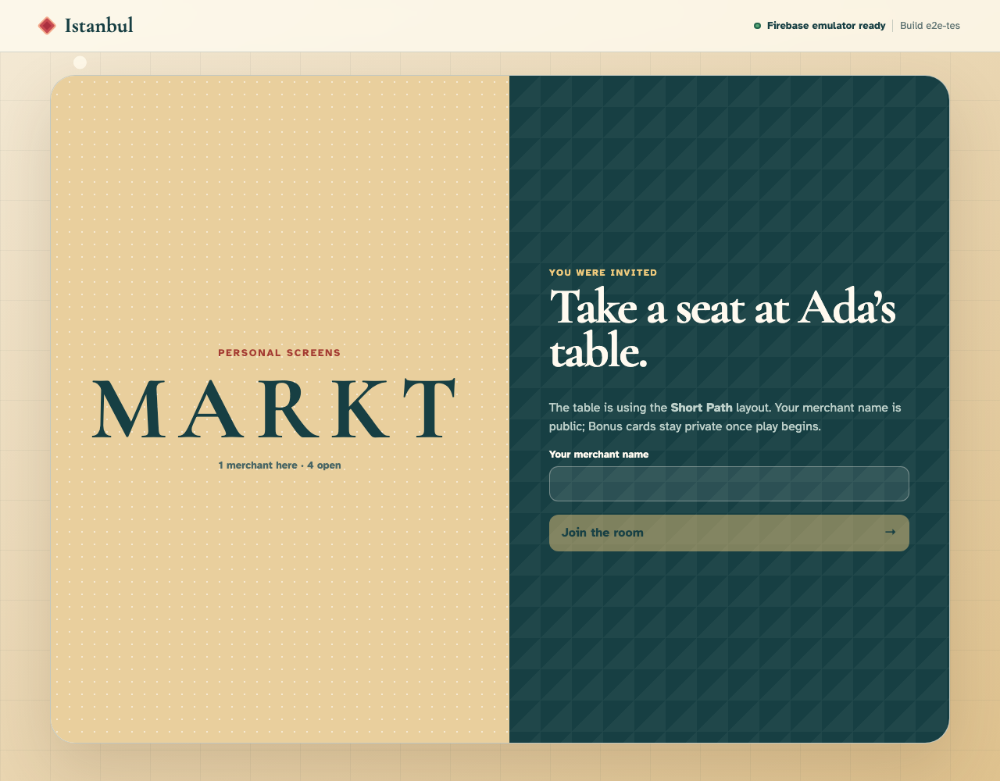
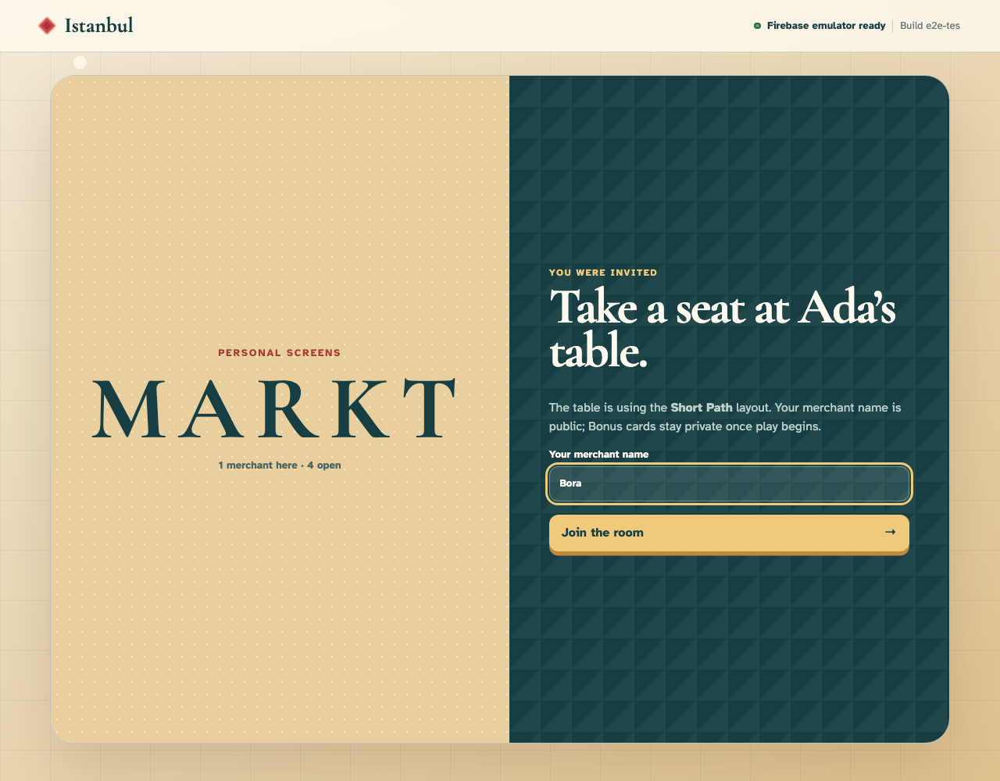
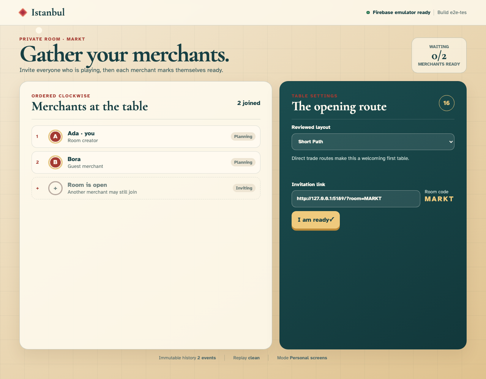
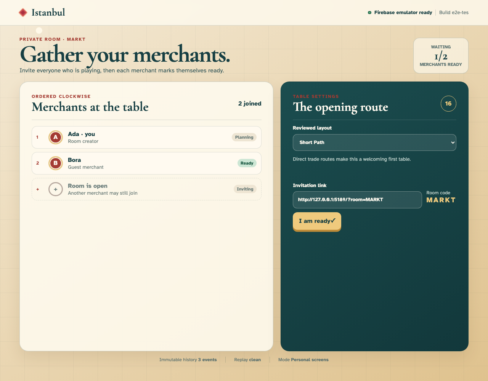
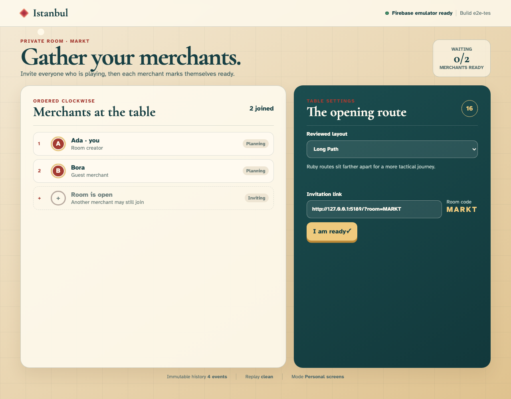
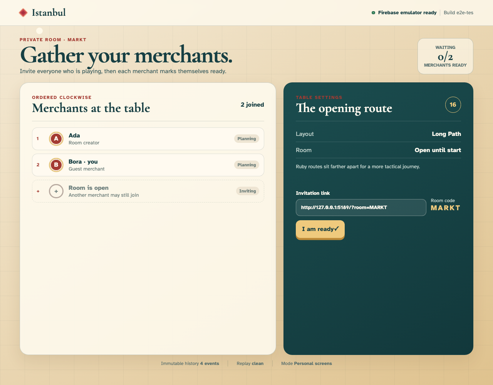
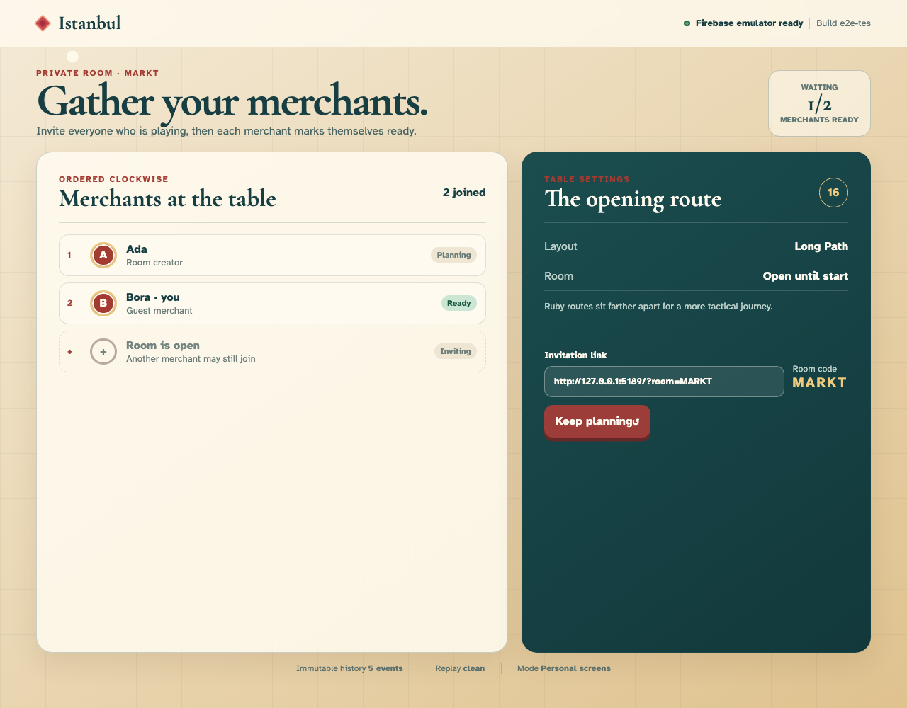
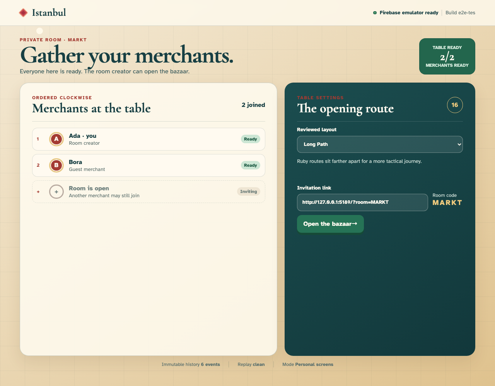
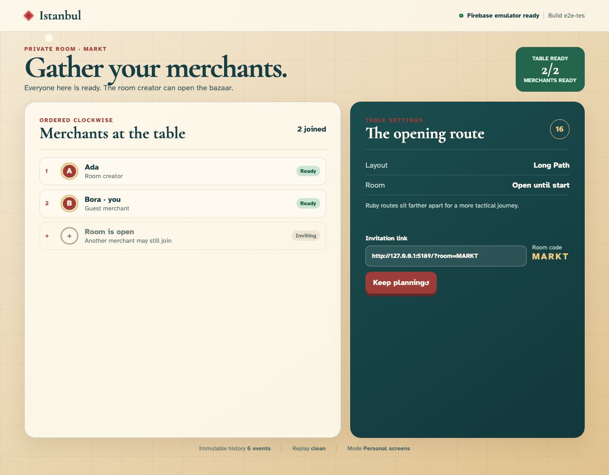

# Creating and preparing a private Istanbul room

Ada opens a private table, Bora follows the invitation in an isolated browser, and both merchants watch an immutable room history converge through configuration, readiness, and reload.

## 1. Ada arrives at the private-room creator

**Ada, the host** — Ada arrives at the private-room creator

**Verifications:**

- [x] Firebase authentication is ready before any room action
- [x] The host chooses a reviewed layout without predicting attendance
- [x] No room events exist before Ada creates one

## 2. Ada writes her public merchant name

**Ada, the host** — Ada writes her public merchant name

**Verifications:**

- [x] The exact name is visible in the host field
- [x] Creating the private room becomes available
- [x] Editing the form does not create an event

## 3. Ada creates room MARKT and takes clockwise seat one

**Ada, the host** — Ada creates room MARKT and takes clockwise seat one

**Verifications:**

- [x] The lobby exposes the stable five-letter room code MARKT
- [x] Ada is visibly identified as host and current user
- [x] The immutable projection contains one creation event and one joined merchant

## 4. Bora follows Ada’s invitation to room MARKT

**Bora, the invited merchant** — Bora follows Ada’s invitation to room MARKT

**Verifications:**

- [x] The invitation names Ada as the host
- [x] The public ticket shows one merchant present and room to join
- [x] Bora replays the creation event but has no local seat

## 5. Bora writes his merchant name before claiming a seat

**Bora, the invited merchant** — Bora writes his merchant name before claiming a seat

**Verifications:**

- [x] The exact invited-player name remains visible
- [x] The join control becomes available without changing room state
- [x] The replay still contains only Ada’s creation event

## 6. Bora joins and receives clockwise seat two

**Bora, the invited merchant** — Bora joins and receives clockwise seat two

**Verifications:**

- [x] Bora sees himself in seat two and Ada in seat one
- [x] The guest sees the Short Path configuration selected by Ada
- [x] The joined projection contains two clean events and ordered seats

## 7. Ada sees Bora’s seat arrive through the shared event stream

**Ada, the host** — Ada sees Bora’s seat arrive through the shared event stream

**Verifications:**

- [x] Bora appears in clockwise seat two without Ada refreshing
- [x] Both merchants are visibly planning
- [x] Ada’s projection independently converges on two events and two seats

## 8. Bora declares that his route is ready

**Bora, the invited merchant** — Bora declares that his route is ready

**Verifications:**

- [x] Bora’s control changes to Keep planning
- [x] Exactly one merchant is visibly ready
- [x] The readiness event is the third accepted event

## 9. Ada sees Bora’s readiness while her own route remains open

**Ada, the host** — Ada sees Bora’s readiness while her own route remains open

**Verifications:**

- [x] The host view reports one of two merchants ready
- [x] Ada can still change the reviewed layout
- [x] Ada independently projects Bora as ready

## 10. Ada changes the table to the tactical Long Path layout

**Ada, the host** — Ada changes the table to the tactical Long Path layout

**Verifications:**

- [x] The host selector and explanation identify Long Path
- [x] Changing configuration visibly clears every readiness marker
- [x] The fourth event atomically changes layout and invalidates readiness

## 11. Bora sees Long Path arrive and understands he must ready again

**Bora, the invited merchant** — Bora sees Long Path arrive and understands he must ready again

**Verifications:**

- [x] The guest’s read-only settings name Long Path
- [x] Bora’s control returns to I am ready
- [x] Bora’s replay matches the fourth event and cleared readiness

## 12. Bora confirms the revised Long Path route

**Bora, the invited merchant** — Bora confirms the revised Long Path route

**Verifications:**

- [x] Bora is ready against the new configuration
- [x] The lobby reports one of two merchants ready
- [x] The fifth event records only Bora’s renewed readiness

## 13. Ada readies last and completes the table

**Ada, the host** — Ada readies last and completes the table

**Verifications:**

- [x] A green Table ready seal confirms the room is complete
- [x] Both seat rows are marked Ready
- [x] The sixth event leaves both ordered seats ready with no diagnostics

## 14. Bora reloads and reconstructs the same ready table from history

**Bora, the invited merchant** — Bora reloads and reconstructs the same ready table from history

**Verifications:**

- [x] The reloaded browser returns directly to Bora’s claimed seat
- [x] Long Path and both ready markers survive reload
- [x] Cache-plus-subscription replay is byte-equivalent at six clean events
