# Opening a seeded bazaar and protecting private cards

Ada and Bora prepare an ordinary two-player room entirely through visible controls. Starting the game deterministically lays out all sixteen illustrated Places, resources, encounter tokens, neutral merchants, and private Bonus hands. They then inspect, zoom, fit, compare, and reload that projection.

## 1. Ada opens a new seeded-room creator

**Ada, the host** — Ada opens a new seeded-room creator

**Verifications:**

- [x] The production room form is ready through Firebase
- [x] Short Path is visible and attendance is not requested
- [x] The projection is an empty landing state

## 2. Ada enters the name that will appear on the board

**Ada, the host** — Ada enters the name that will appear on the board

**Verifications:**

- [x] Ada is visible in the editable field
- [x] Room creation is enabled
- [x] Typing still leaves immutable history empty

## 3. Ada creates room FRUIT before choosing its final route

**Ada, the host** — Ada creates room FRUIT before choosing its final route

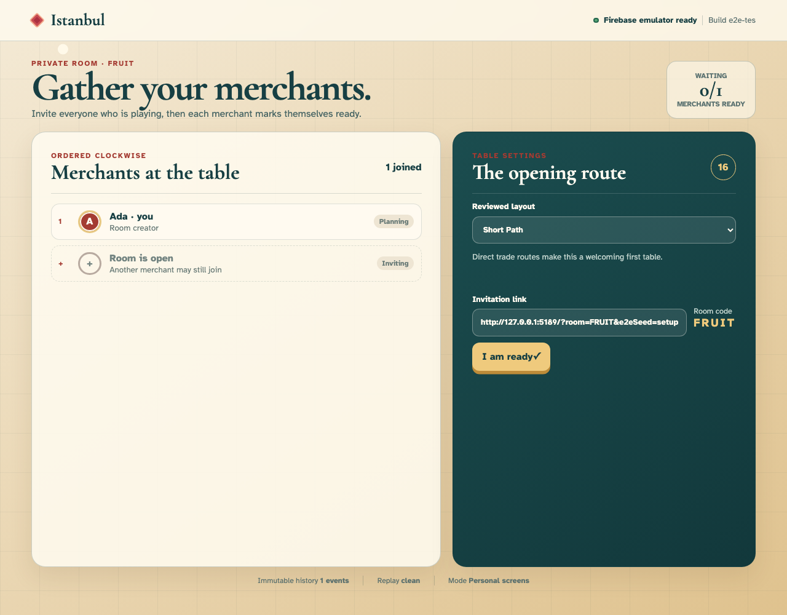

**Verifications:**

- [x] Ada owns clockwise seat one
- [x] The room remains open and exposes Short Path
- [x] Exactly one creation event exists

## 4. Ada chooses the reviewed Long Path board

**Ada, the host** — Ada chooses the reviewed Long Path board

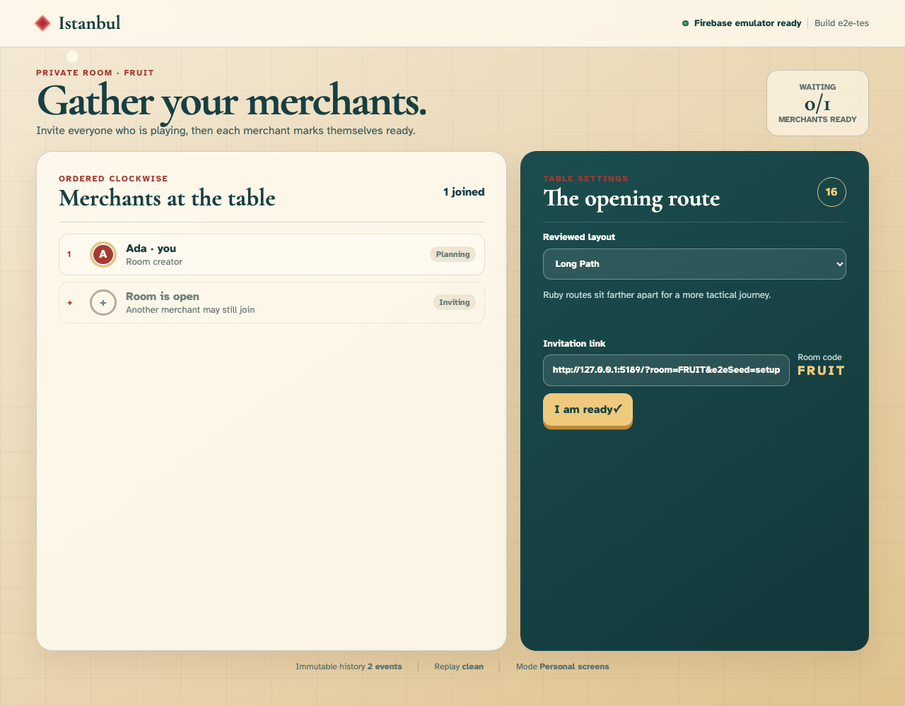

**Verifications:**

- [x] The control and route explanation show Long Path
- [x] No readiness remains after configuration
- [x] A second event stores intent without persisting a board snapshot

## 5. Bora follows the invitation and reviews the chosen table

**Bora, the second merchant** — Bora follows the invitation and reviews the chosen table

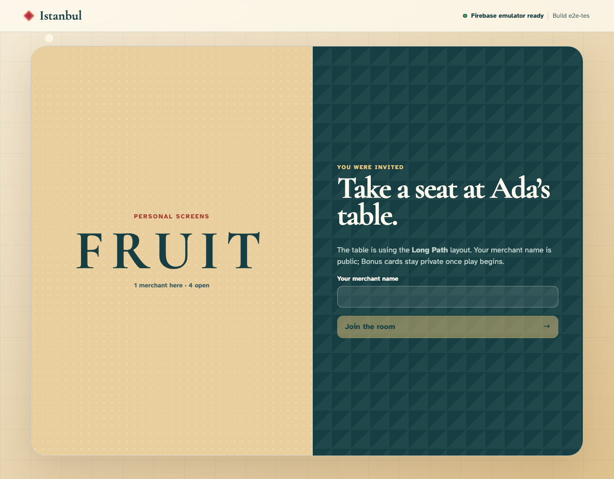

**Verifications:**

- [x] Ada’s invitation and Long Path are visible
- [x] Only Ada is present and the room is still open
- [x] Bora replays two public events but has no private game state

## 6. Bora enters his public merchant name

**Bora, the second merchant** — Bora enters his public merchant name

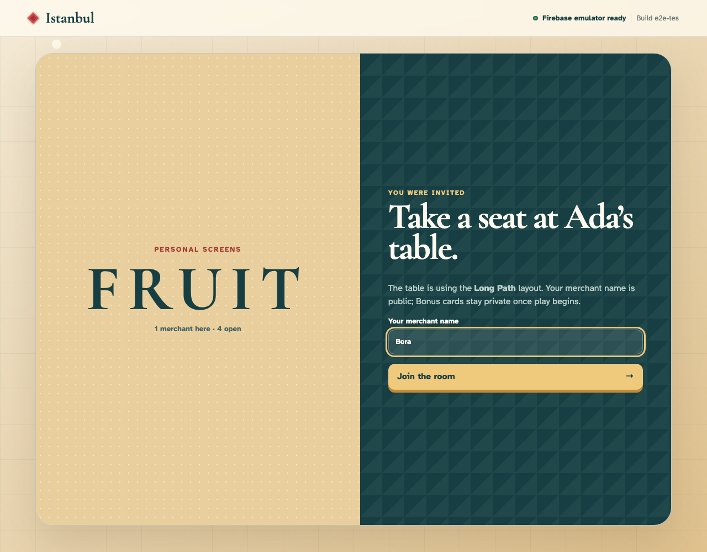

**Verifications:**

- [x] Bora’s exact name remains in the invite form
- [x] The ordinary Join the room control is enabled
- [x] No event is appended until Bora confirms

## 7. Bora claims clockwise seat two

**Bora, the second merchant** — Bora claims clockwise seat two

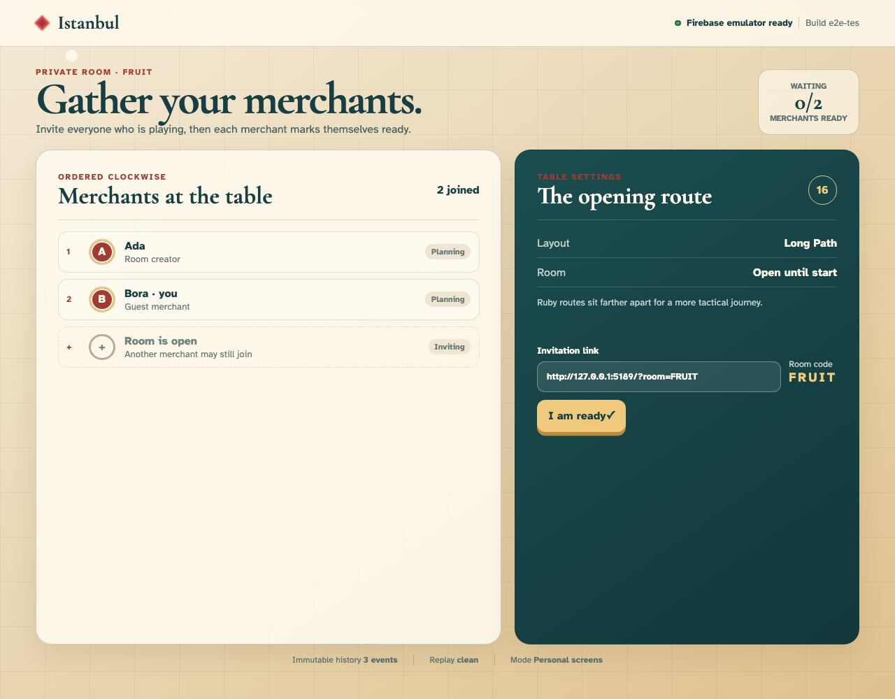

**Verifications:**

- [x] Both named merchants are visible in order
- [x] Bora sees Long Path as read-only room configuration
- [x] The join is the third clean event

## 8. Bora readies for the committed layout

**Bora, the second merchant** — Bora readies for the committed layout

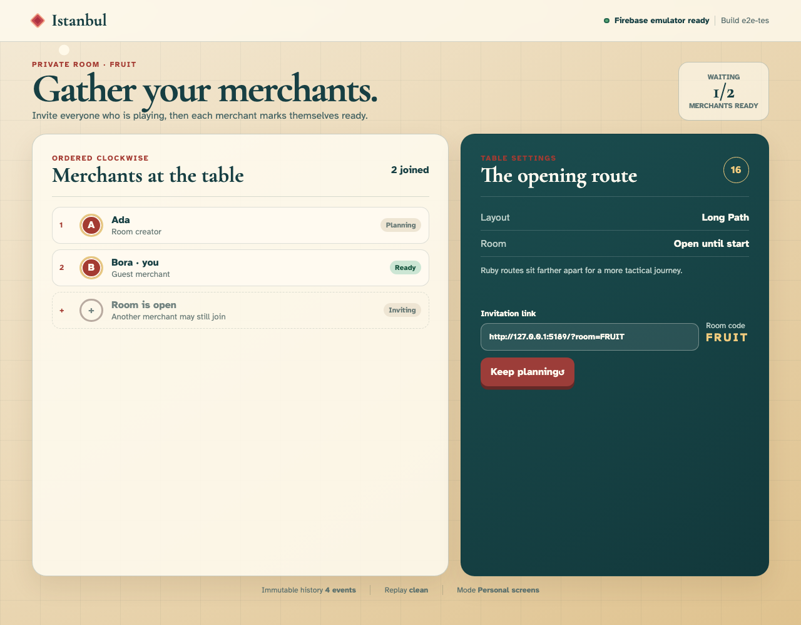

**Verifications:**

- [x] Bora can visibly choose Keep planning again
- [x] One of two merchants is ready
- [x] The fourth event records Bora’s readiness only

## 9. Ada readies last and receives the real start control

**Ada, the host** — Ada readies last and receives the real start control

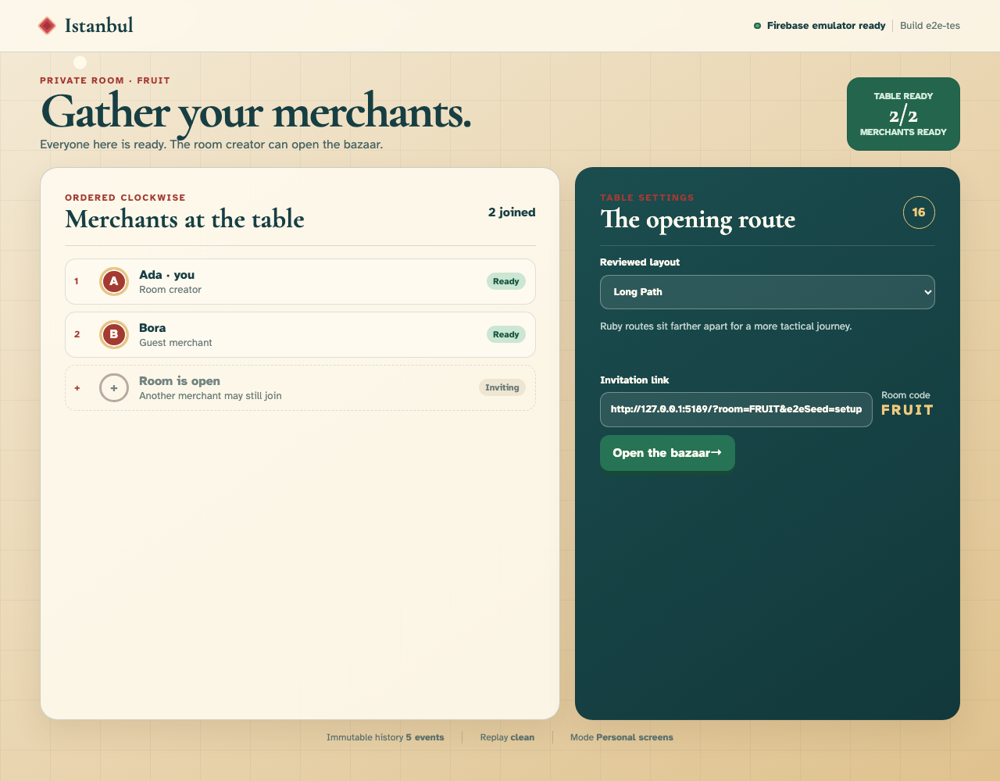

**Verifications:**

- [x] The lobby reports Table ready
- [x] Open the bazaar is enabled only for the host
- [x] Five events leave both seats ready and no game materialized yet

## 10. Ada commits the setup seed and opens all sixteen Places

**Ada, the host** — Ada commits the setup seed and opens all sixteen Places

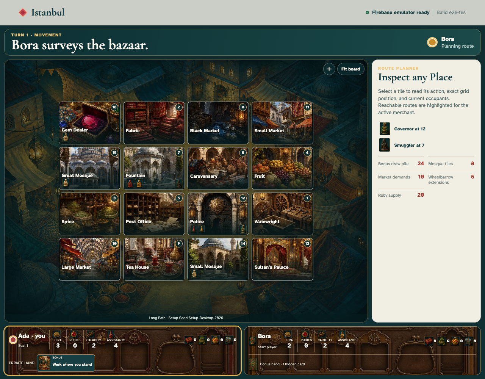

**Verifications:**

- [x] The illustrated board contains exactly sixteen accessible Place buttons
- [x] Long Path begins 16, 2, 8, 11 and both merchants occupy Fountain 7
- [x] The sixth event derives a deterministic movement-phase setup with private hand masking

## 11. Bora sees the same public board with his own private hand

**Bora, the second merchant** — Bora sees the same public board with his own private hand

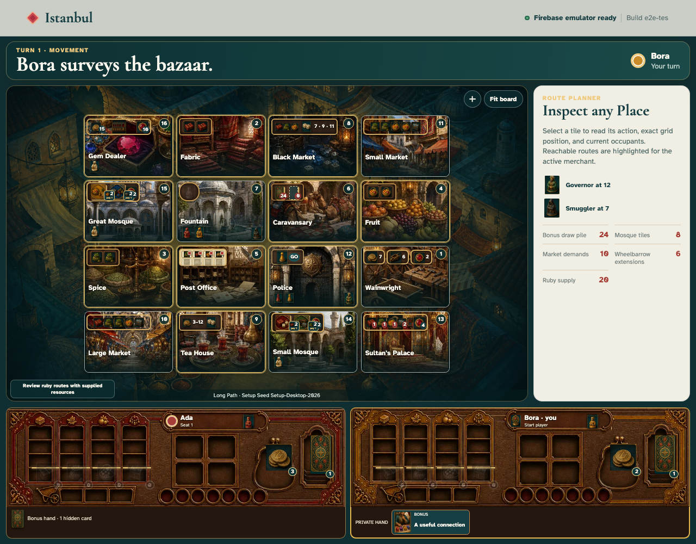

**Verifications:**

- [x] Bora independently renders all sixteen Places
- [x] Ada’s Bonus hand is represented only by a hidden-card count
- [x] Bora’s canonical public setup matches while his local hand differs by ownership

## 12. Ada inspects Fountain 7 before planning movement

**Ada, the host** — Ada inspects Fountain 7 before planning movement

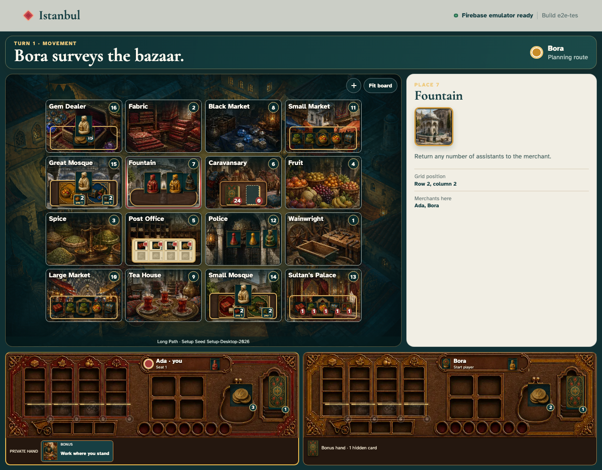

**Verifications:**

- [x] The Fountain tile is selected and its full action is visible
- [x] The inspector reports row two, column two and both merchants
- [x] Inspection changes local view state without appending an event

## 13. Ada zooms the courtyard board for a closer route view

**Ada, the host** — Ada zooms the courtyard board for a closer route view

**Verifications:**

- [x] The complete board remains present while zoomed
- [x] Fountain remains the selected accessible tile
- [x] Only Ada’s local board scale changes to 1.09

## 14. Ada fits the complete 4×4 bazaar back into view

**Ada, the host** — Ada fits the complete 4×4 bazaar back into view

**Verifications:**

- [x] All sixteen Places are available after fitting
- [x] The Long Path caption retains the committed seed
- [x] Fit returns local scale to exactly one without a network event

## 15. Bora opens his dealt Bonus card in the private inspector

**Bora, the second merchant** — Bora opens his dealt Bonus card in the private inspector

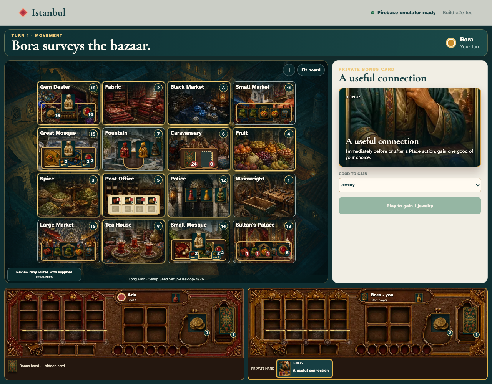

**Verifications:**

- [x] The selected card title and complete rules text are visible to Bora
- [x] Ada remains represented as one hidden opponent card
- [x] Selecting the private card changes no canonical event or public setup

## 16. Ada’s observer view continues to mask Bora’s private card

**Ada, the host** — Ada’s observer view continues to mask Bora’s private card

**Verifications:**

- [x] No private-card inspector opens in Ada’s browser
- [x] Bora remains exactly one hidden card in Ada’s DOM
- [x] Ada’s serialized selector contains only her card ID and Bora’s count

## 17. Bora reloads and reconstructs the same setup and private ownership

**Bora, the second merchant** — Bora reloads and reconstructs the same setup and private ownership

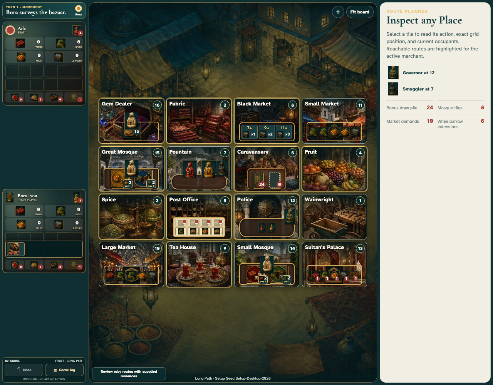

**Verifications:**

- [x] The board returns with all sixteen Place controls
- [x] Bora’s own Bonus card returns while Ada’s stays hidden
- [x] Fresh replay restores the exact seed, board, turn, event count, and local hand
