# Walk up to an Istanbul tabletop and join by QR

The dedicated /tabletop route creates and owns an empty shared-table room. Ada and Bora walk up, scan its QR codes, join and ready on private phones, then the tabletop starts play. Unclaimed positions disappear when the bazaar replaces the lobby. Every action is followed by exact screenshots, DOM checks, and serialized replay-state assertions.

## 1. The tabletop opens empty room TABLE

**The dedicated tabletop** — The tabletop opens empty room TABLE

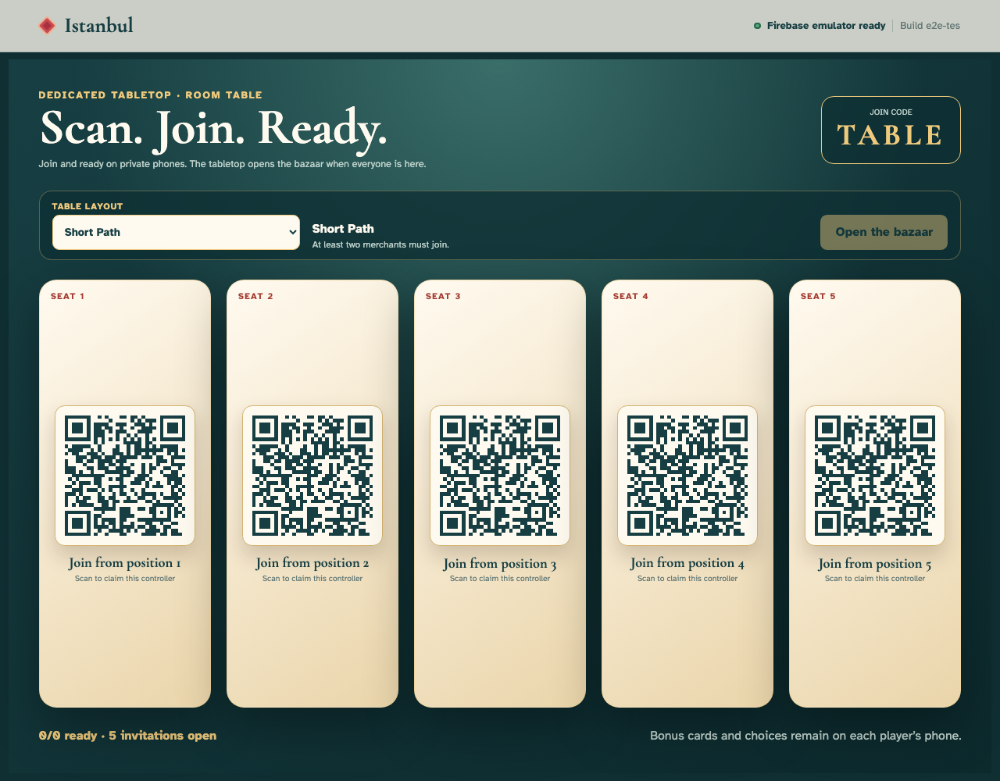

**Verifications:**

- [x] The direct tabletop route creates five QR invitations without claiming a merchant seat
- [x] The tabletop owns the sole creation event and stays outside the roster
- [x] The tabletop owns layout and start controls, with start disabled until two players join and ready

## 2. Ada scans a tabletop QR on her phone

**Ada’s private phone** — Ada scans a tabletop QR on her phone

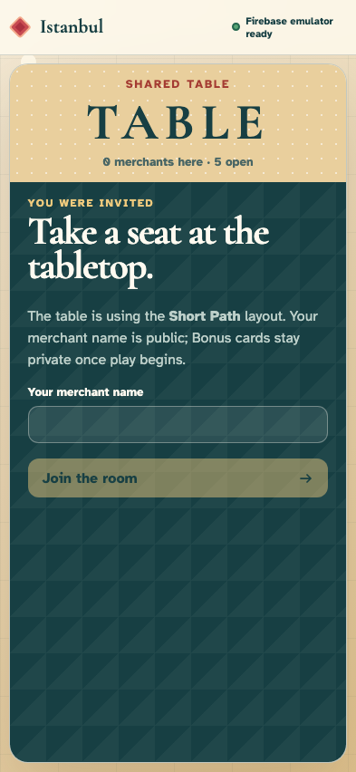

**Verifications:**

- [x] The QR opens only a private-controller join screen
- [x] Ada is not seated while the empty tabletop room replays

## 3. Ada enters her public merchant name

**Ada’s private phone** — Ada enters her public merchant name

**Verifications:**

- [x] The private phone retains Ada’s name without writing an event

## 4. Ada joins as the first merchant

**Ada’s private phone** — Ada joins as the first merchant

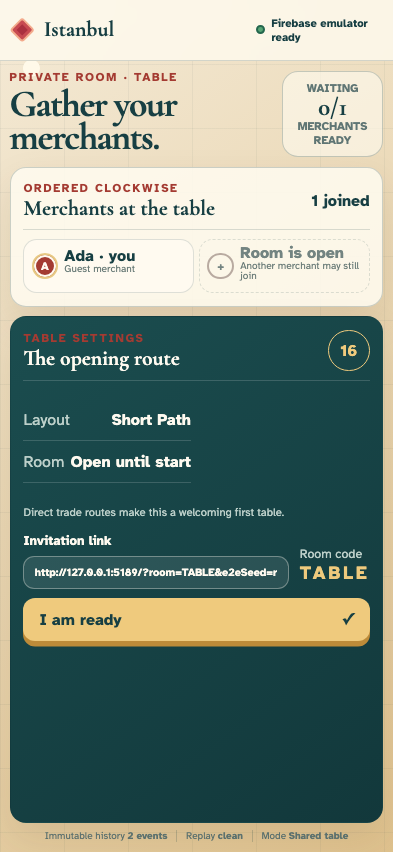

**Verifications:**

- [x] Ada’s phone identifies her without granting tabletop ownership
- [x] The join is event two and Ada is the only player

## 5. The tabletop replaces one QR with Ada

**The dedicated tabletop** — The tabletop replaces one QR with Ada

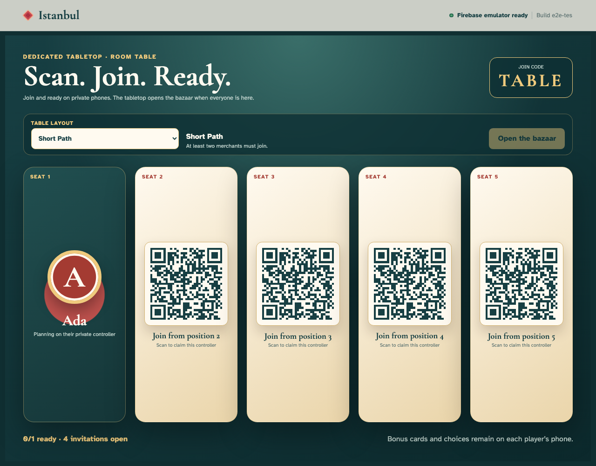

**Verifications:**

- [x] Ada occupies one public position while four invitations remain
- [x] The tabletop remains seatless at the same two-event cursor

## 6. Bora scans an open tabletop QR

**Bora’s private phone** — Bora scans an open tabletop QR

**Verifications:**

- [x] Bora sees the same private-controller join screen
- [x] Ada is present but Bora has not yet joined

## 7. Bora enters his public merchant name

**Bora’s private phone** — Bora enters his public merchant name

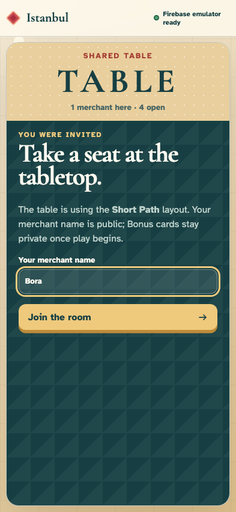

**Verifications:**

- [x] Typing remains local until the join action

## 8. Bora joins as the second merchant

**Bora’s private phone** — Bora joins as the second merchant

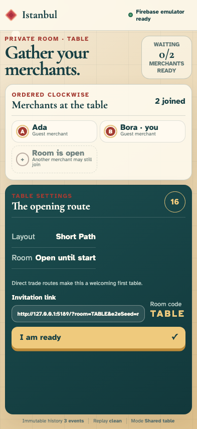

**Verifications:**

- [x] Bora’s private phone shows both joined merchants
- [x] The second join is event three

## 9. The tabletop shows both joined merchants

**The dedicated tabletop** — The tabletop shows both joined merchants

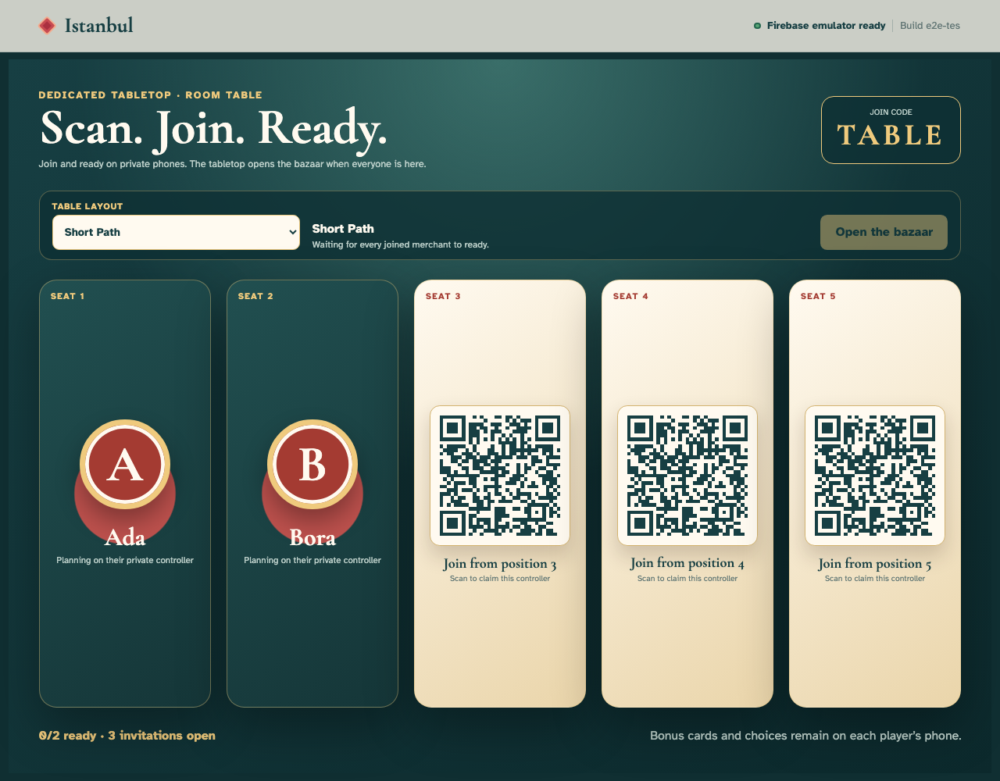

**Verifications:**

- [x] Ada and Bora occupy public positions while three QR invitations remain
- [x] Start remains disabled until both private phones are ready

## 10. Ada readies on her private phone

**Ada’s private phone** — Ada readies on her private phone

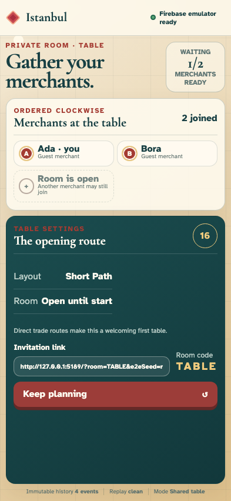

**Verifications:**

- [x] Ada sees one of two merchants ready
- [x] Only Ada is ready in event four

## 11. Bora readies on his private phone

**Bora’s private phone** — Bora readies on his private phone

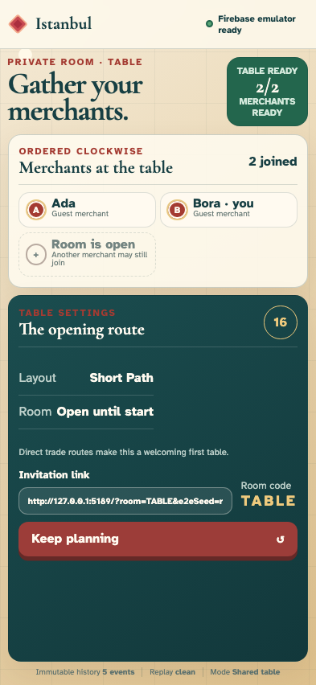

**Verifications:**

- [x] Both merchants are ready but no phone receives a start control
- [x] Both readiness events are replayed without creating a game

## 12. The tabletop unlocks the start control

**The dedicated tabletop** — The tabletop unlocks the start control

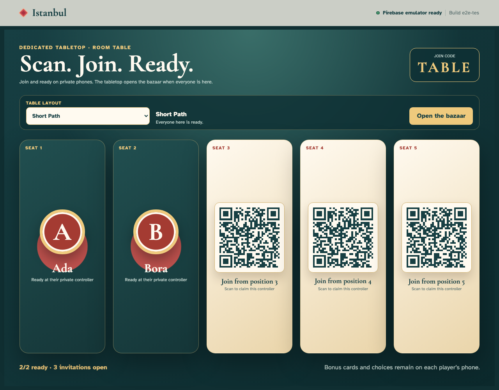

**Verifications:**

- [x] The tabletop announces everyone present is ready
- [x] Only the dedicated tabletop can now open the bazaar
- [x] Three unclaimed QR positions remain visible until start

## 13. The tabletop starts play and becomes the public bazaar

**The dedicated tabletop** — The tabletop starts play and becomes the public bazaar

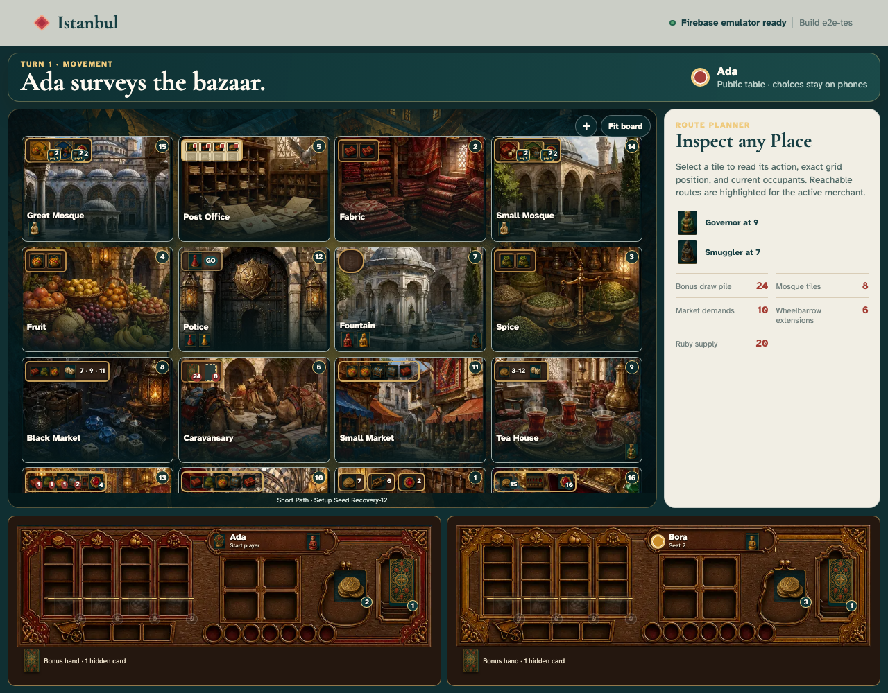

**Verifications:**

- [x] The public board replaces every joined and unclaimed lobby position
- [x] The sixth event starts Ada’s seeded movement turn
- [x] No private Bonus hand appears in public DOM or state

## 14. Ada’s private phone receives the opening turn

**Ada’s private phone** — Ada’s private phone receives the opening turn

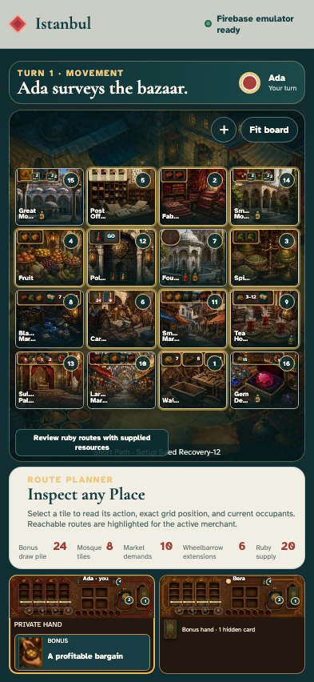

**Verifications:**

- [x] Ada sees sixteen Places and her private hand
- [x] Ada’s controller agrees with the tabletop at event six

## 15. Ada inspects a route on her private phone

**Ada’s private phone** — Ada inspects a route on her private phone

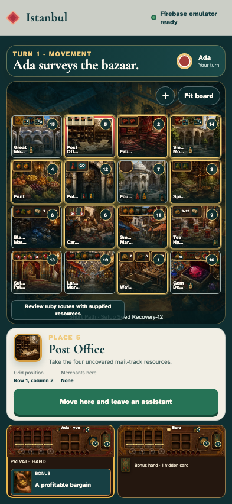

**Verifications:**

- [x] The selected Place is pressed and its move action is enabled
- [x] Inspection remains local at event six

## 16. Ada commits movement from her private phone

**Ada’s private phone** — Ada commits movement from her private phone

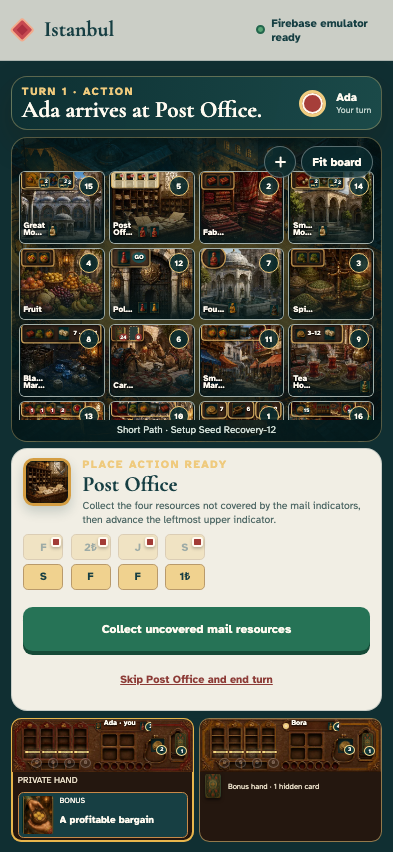

**Verifications:**

- [x] Ada advances into a Place action

## 17. The tabletop mirrors Ada’s committed move

**The dedicated tabletop** — The tabletop mirrors Ada’s committed move

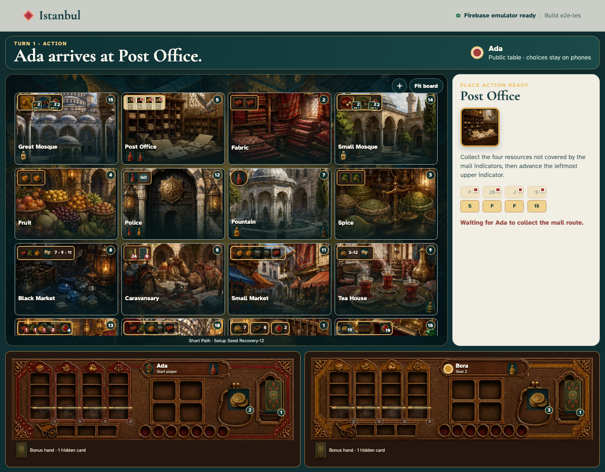

**Verifications:**

- [x] The public table announces Ada’s arrival
- [x] Public replay reaches event seven while hidden state remains masked

## 18. The tabletop reloads its retained room

**The dedicated tabletop** — The tabletop reloads its retained room

**Verifications:**

- [x] Reload preserves the tabletop URL and public bazaar instead of creating another room
- [x] Table ownership and the seven-event cursor survive reload
