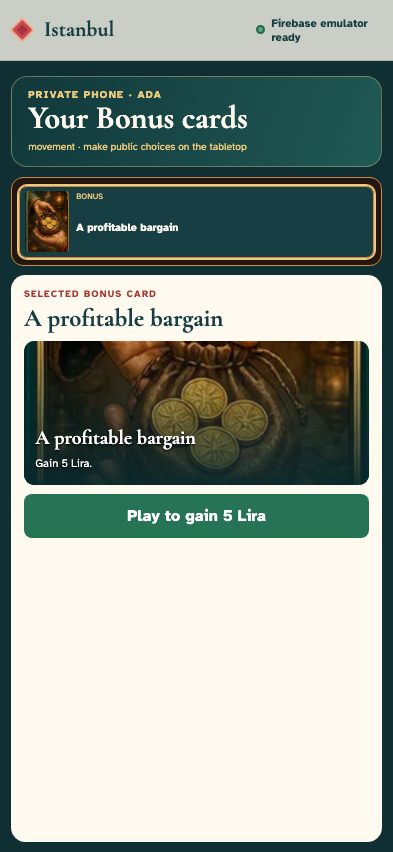
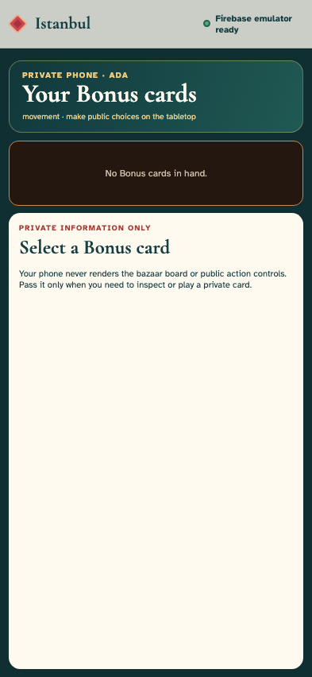
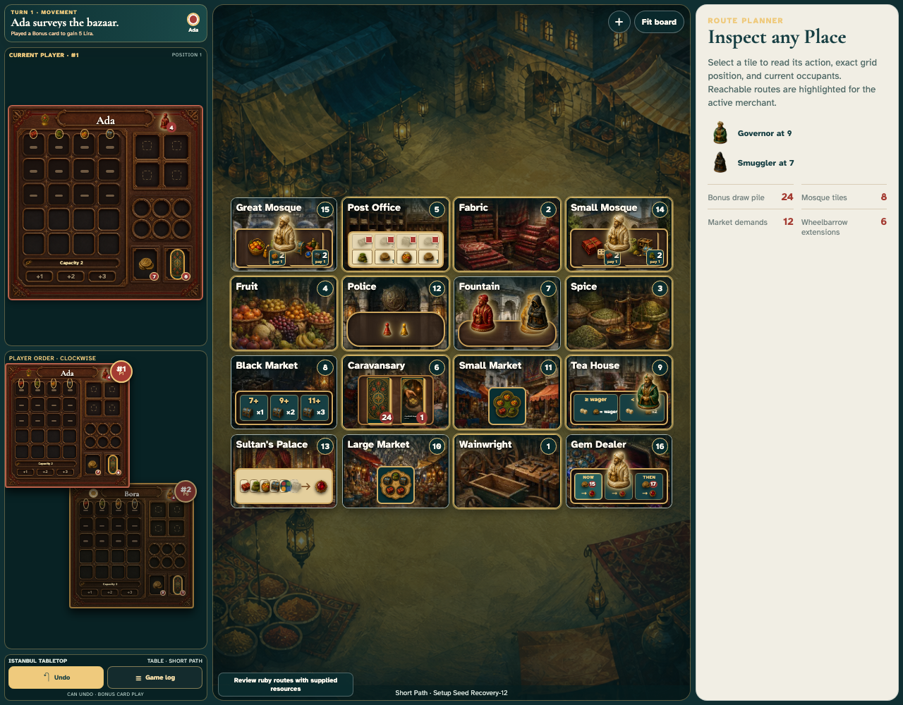
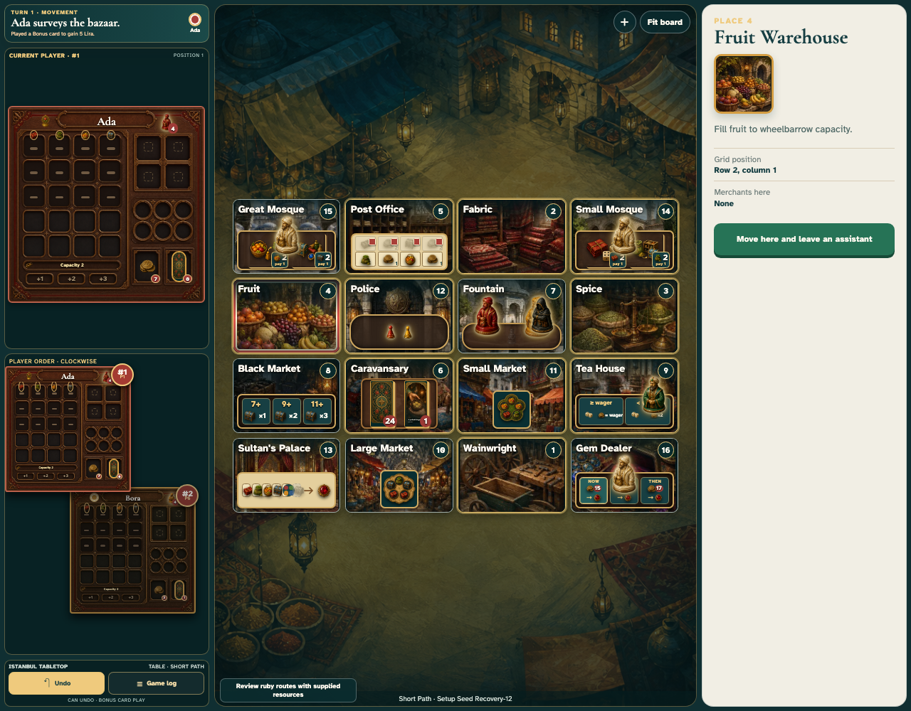
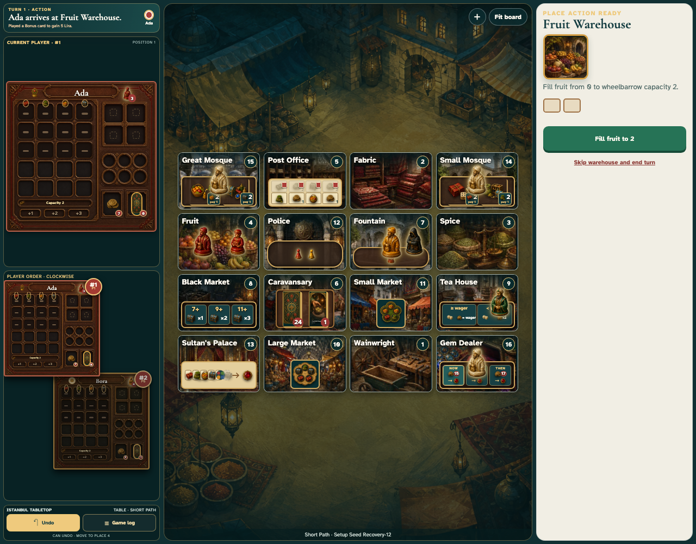
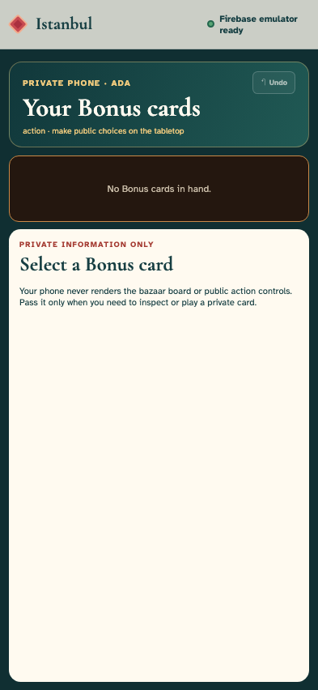
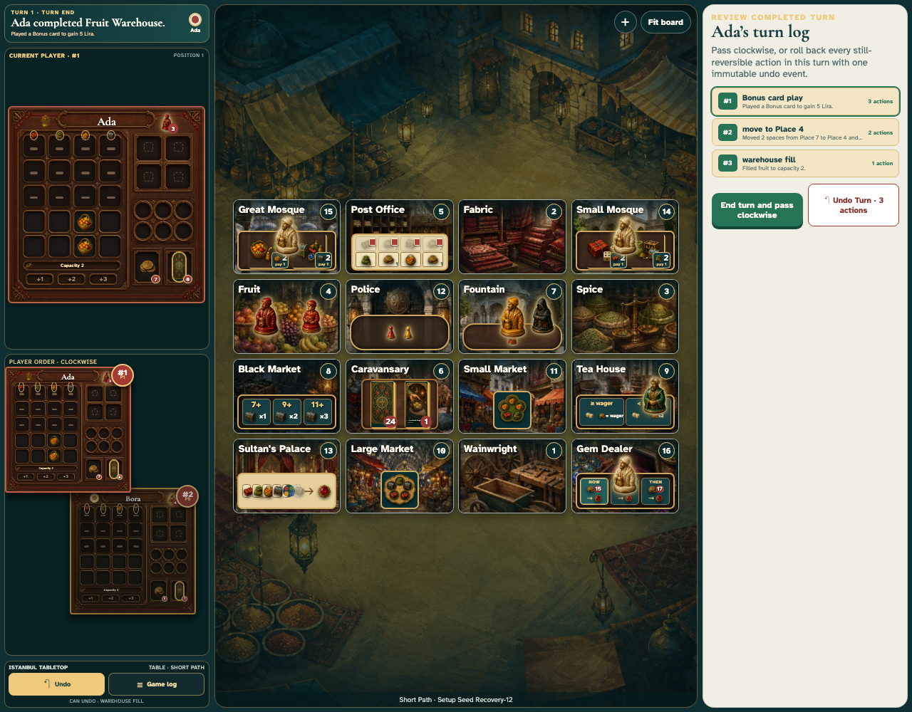
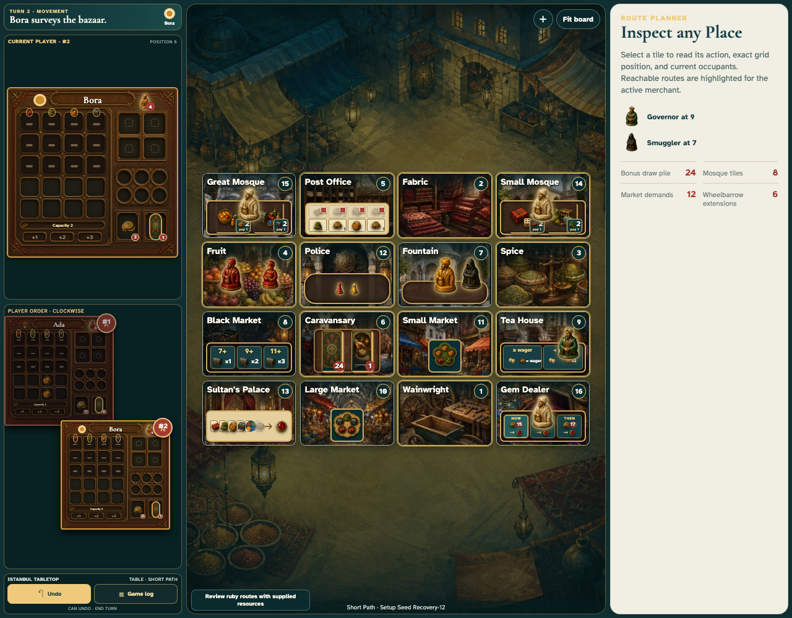
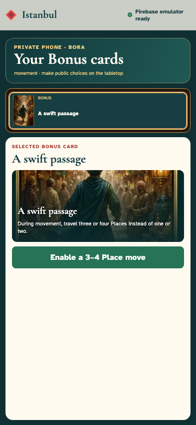

# Play Istanbul together on one tabletop with private Bonus phones

The dedicated /tabletop route arranges eight join positions around the display. Ada claims the top-left corner and Bora the bottom edge; setup chooses one occupied position as Player 1 and continues clockwise across the occupied positions. During play, the control column enlarges and duplicates the current upright player mat above a stacked clockwise card set. Phones retain only each player’s private Bonus-card hand while the tabletop owns every public choice. Every input is followed by exact screenshots, DOM checks, fitted-interface checks, and serialized replay-state assertions.

## 1. The tabletop opens empty room TABLE

**The dedicated tabletop** — The tabletop opens empty room TABLE

**Verifications:**

- [x] The direct tabletop route creates eight physical-position invitations without claiming a merchant seat
- [x] The tabletop owns the sole creation event and stays outside the roster
- [x] The tabletop owns layout and start controls, with start disabled until two players join and ready

## 2. Ada scans a tabletop QR on her phone

**Ada’s private phone** — Ada scans a tabletop QR on her phone

**Verifications:**

- [x] The QR opens its exact private-controller position
- [x] Ada is not seated while the empty tabletop room replays

## 3. Ada enters her public merchant name

**Ada’s private phone** — Ada enters her public merchant name

**Verifications:**

- [x] The private phone retains Ada’s name without writing an event

## 4. Ada joins as the first merchant

**Ada’s private phone** — Ada joins as the first merchant

**Verifications:**

- [x] Ada’s phone identifies her without granting tabletop ownership
- [x] The join is event two and Ada is the only player

## 5. The tabletop replaces one QR with Ada

**The dedicated tabletop** — The tabletop replaces one QR with Ada

**Verifications:**

- [x] Ada occupies physical position one while seven invitations remain
- [x] The tabletop remains seatless at the same two-event cursor

## 6. Bora scans an open tabletop QR

**Bora’s private phone** — Bora scans an open tabletop QR

**Verifications:**

- [x] Bora receives the selected bottom-edge physical position
- [x] Ada is present but Bora has not yet joined

## 7. Bora enters his public merchant name

**Bora’s private phone** — Bora enters his public merchant name

**Verifications:**

- [x] Typing remains local until the join action

## 8. Bora joins as the second merchant

**Bora’s private phone** — Bora joins as the second merchant

**Verifications:**

- [x] Bora’s private phone shows both joined merchants
- [x] The second join is event three and clockwise order skips the empty positions between them

## 9. The tabletop shows both joined merchants

**The dedicated tabletop** — The tabletop shows both joined merchants

**Verifications:**

- [x] Ada and Bora occupy distinct physical positions while six position invitations remain
- [x] Start remains disabled until both private phones are ready

## 10. Ada readies on her private phone

**Ada’s private phone** — Ada readies on her private phone

**Verifications:**

- [x] Ada sees one of two merchants ready
- [x] Only Ada is ready in event four

## 11. Bora readies on his private phone

**Bora’s private phone** — Bora readies on his private phone

**Verifications:**

- [x] Both merchants are ready but no phone receives a start control
- [x] Both readiness events are replayed without creating a game

## 12. The tabletop unlocks the start control

**The dedicated tabletop** — The tabletop unlocks the start control

**Verifications:**

- [x] The tabletop projects everyone present as ready
- [x] Only the dedicated tabletop can now open the bazaar
- [x] Six unclaimed physical positions remain visible until start

## 13. The tabletop starts play and becomes the public bazaar

**The dedicated tabletop** — The tabletop starts play and becomes the public bazaar

**Verifications:**

- [x] The public board replaces every joined and unclaimed lobby position
- [x] The sixth event starts Ada’s seeded movement turn
- [x] The current mat is enlarged upright and duplicated in the clockwise player-card stack without exposing private cards

## 14. Ada’s private phone receives the opening turn

**Ada’s private phone** — Ada’s private phone receives the opening turn

**Verifications:**

- [x] Ada sees only her private Bonus-card controller
- [x] The phone contains no bazaar board, Place controls, public trays, or end-turn control
- [x] Ada’s controller agrees with the tabletop at event six

## 15. Ada privately inspects her Bonus card

**Ada’s private phone** — Ada privately inspects her Bonus card

**Verifications:**

- [x] Only Ada’s phone reveals the card title, artwork, rules, and enabled play control
- [x] The tabletop still contains no private title or card face
- [x] Private inspection is local and appends no event

## 16. Ada plays the private Bonus card from her phone

**Ada’s private phone** — Ada plays the private Bonus card from her phone

**Verifications:**

- [x] The private hand is now empty and returns to its explanatory resting state
- [x] Only the Bonus-card event is appended and Ada gains exactly 5 Lira

## 17. The tabletop reflects the public consequence of Ada’s card

**The dedicated tabletop** — The tabletop reflects the public consequence of Ada’s card

**Verifications:**

- [x] Ada’s enlarged current-player mat shows 7 Lira and zero Bonus cards while the spent card becomes the public discard
- [x] The public log describes the effect while movement still belongs to the tabletop

## 18. Ada selects Fruit Warehouse on the shared tabletop

**The dedicated tabletop** — Ada selects Fruit Warehouse on the shared tabletop

**Verifications:**

- [x] The tabletop presses the public Place and offers the normal assistant drop
- [x] Route inspection stays local to the table and creates no event

## 19. Ada commits movement on the shared tabletop

**The dedicated tabletop** — Ada commits movement on the shared tabletop

**Verifications:**

- [x] The tabletop opens the public Fruit Warehouse action
- [x] The tabletop-authored event records Ada’s assistant drop and no diagnostic

## 20. Ada’s phone remains private while the tabletop resolves Fruit Warehouse

**Ada’s private phone** — Ada’s phone remains private while the tabletop resolves Fruit Warehouse

**Verifications:**

- [x] The phone reports the public phase but renders no Warehouse action
- [x] Phone replay agrees with the tabletop at event eight

## 21. Ada fills fruit from the shared tabletop

**The dedicated tabletop** — Ada fills fruit from the shared tabletop

**Verifications:**

- [x] The tabletop advances to the public end-turn decision
- [x] Fruit and the immutable public action are exact at event nine

## 22. Ada passes clockwise on the shared tabletop

**The dedicated tabletop** — Ada passes clockwise on the shared tabletop

**Verifications:**

- [x] The narrow shared turn strip now gives Bora the tabletop
- [x] Bora begins event ten with no diagnostic

## 23. Bora privately inspects his Bonus card before using the tabletop

**Bora’s private phone** — Bora privately inspects his Bonus card before using the tabletop

**Verifications:**

- [x] Bora alone sees A swift passage and can enable its private movement effect
- [x] Bora’s phone still has no board or public movement destination controls
- [x] The tabletop does not reveal Bora’s title and private inspection adds no event

## 24. The tabletop reloads its retained room

**The dedicated tabletop** — The tabletop reloads its retained room

**Verifications:**

- [x] Reload preserves the tabletop URL and public bazaar instead of creating another room
- [x] Table ownership and the ten-event cursor survive reload
- [x] Reload restores working public controls without exposing private card identities
