# A shared Istanbul table with private phone controllers

Ada creates a shared-table room on her phone, the central screen deliberately enters public-display mode, and its real seat-two QR resolves to Bora’s private controller invitation. The two merchants ready and start from their phones; the public board follows the immutable game without revealing either Bonus hand. Ada inspects and commits a move from her controller, the large display mirrors only public movement, and a controller reload proves anonymous-auth seat ownership survives reconnect. Every user action is followed immediately by DOM and serialized-state checks plus an exact screenshot—including the 3840×2160 tabletop surface.

## 1. Ada opens the table creator on her phone

**Ada, seat-one phone** — Ada opens the table creator on her phone

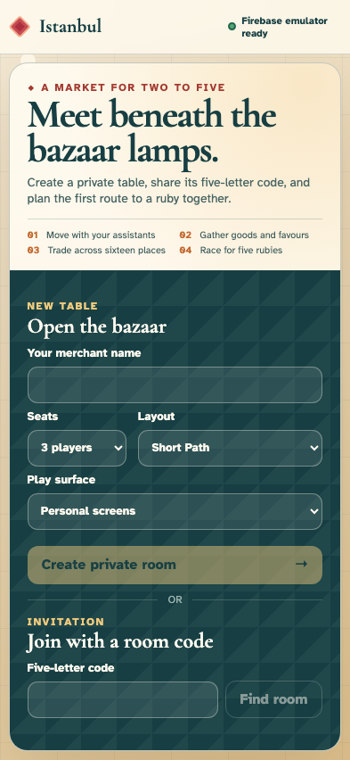

**Verifications:**

- [x] Firebase is ready and no room exists yet
- [x] Both personal-screen and shared-table surfaces are available

## 2. Ada enters her public merchant name

**Ada, seat-one phone** — Ada enters her public merchant name

**Verifications:**

- [x] The creator retains Ada’s name without writing history

## 3. Ada chooses a two-seat table

**Ada, seat-one phone** — Ada chooses a two-seat table

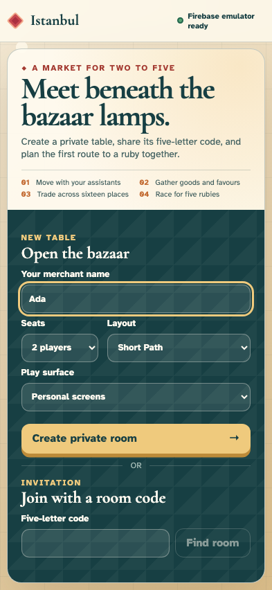

**Verifications:**

- [x] Two seats and Short Path are visible draft values
- [x] Draft configuration is still local

## 4. Ada selects a shared table with private phones

**Ada, seat-one phone** — Ada selects a shared table with private phones

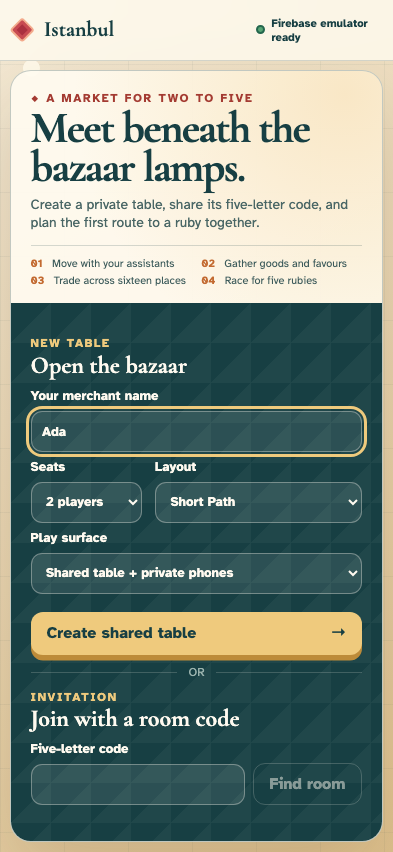

**Verifications:**

- [x] The submit action now promises a shared table
- [x] Surface selection has not appended an event

## 5. Ada creates shared table TABLE

**Ada, seat-one phone** — Ada creates shared table TABLE

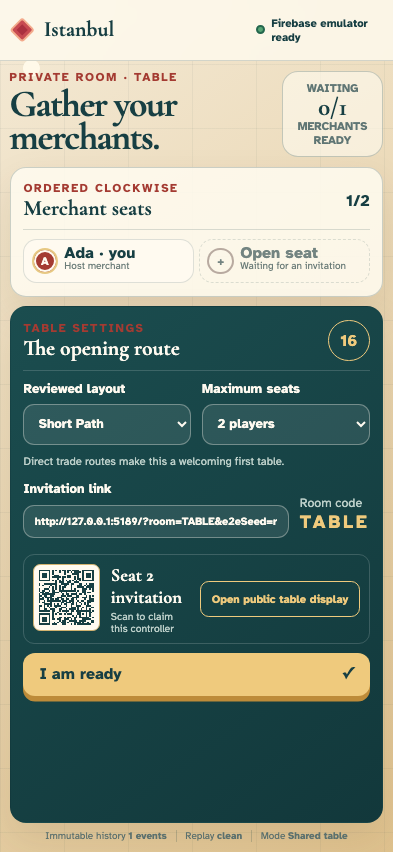

**Verifications:**

- [x] Ada owns seat one and sees a real seat-two QR invitation
- [x] The first canonical event records shared-table mode

## 6. The central screen opens the room invitation

**The public table display** — The central screen opens the room invitation

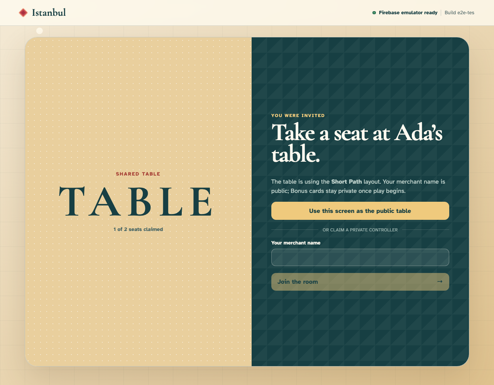

**Verifications:**

- [x] The screen offers public-table mode before asking for a private name
- [x] An unseated display sees one event and no local seat

## 7. The central screen becomes the public table

**The public table display** — The central screen becomes the public table

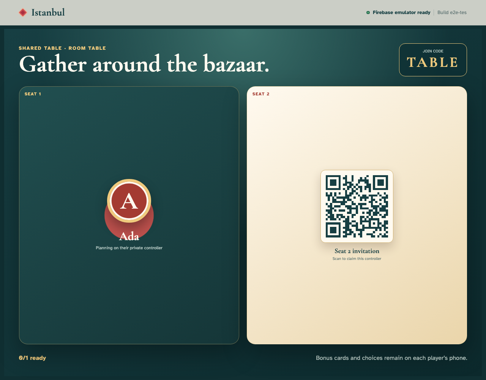

**Verifications:**

- [x] The tabletop shows the room code and an unclaimed seat-two QR
- [x] The QR carries a seat-two invitation and display identity remains absent

## 8. Bora follows the seat-two QR invitation on his phone

**Bora, seat-two phone** — Bora follows the seat-two QR invitation on his phone

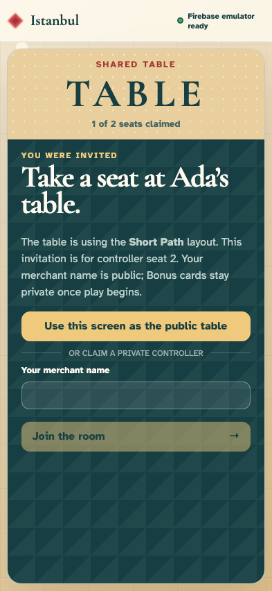

**Verifications:**

- [x] The invitation identifies controller seat two and Ada’s table
- [x] Bora is unseated while the creation event replays

## 9. Bora enters his public merchant name

**Bora, seat-two phone** — Bora enters his public merchant name

**Verifications:**

- [x] Bora’s private controller retains the entered name
- [x] No event is written until Bora claims the seat

## 10. Bora claims seat two from his phone

**Bora, seat-two phone** — Bora claims seat two from his phone

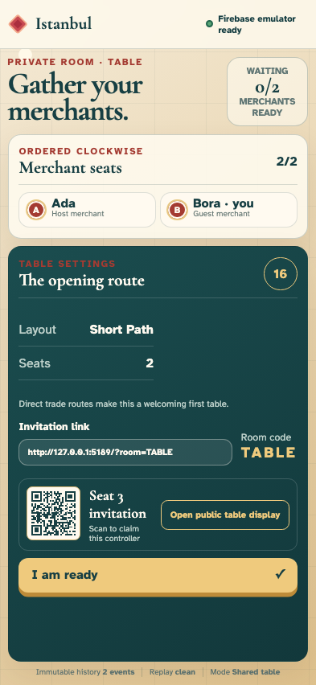

**Verifications:**

- [x] Bora’s phone labels seat two as his
- [x] The join is the second canonical event

## 11. The public table mirrors both claimed controllers

**The public table display** — The public table mirrors both claimed controllers

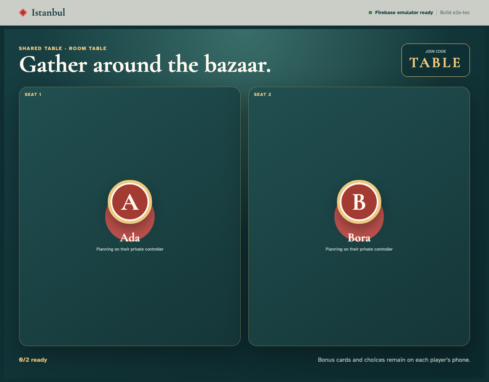

**Verifications:**

- [x] Ada and Bora replace the QR invitations on the public display
- [x] The public display replays the same two events without claiming a seat

## 12. Bora readies from his private controller

**Bora, seat-two phone** — Bora readies from his private controller

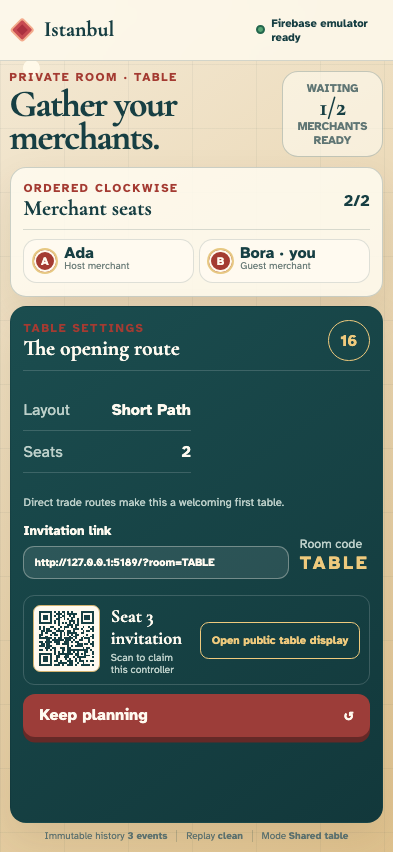

**Verifications:**

- [x] Bora sees one of two merchants ready
- [x] Only seat two is ready in event three

## 13. Ada readies and unlocks start on her phone

**Ada, seat-one phone** — Ada readies and unlocks start on her phone

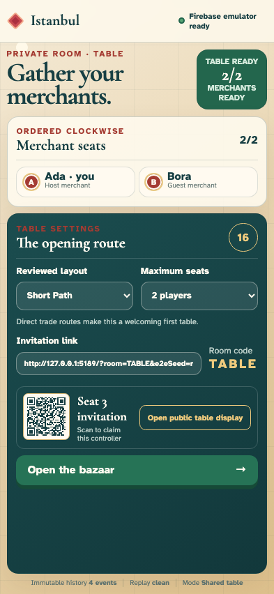

**Verifications:**

- [x] Ada sees Table ready and an enabled opening action
- [x] Both seats are ready after four events

## 14. Ada starts the bazaar from seat one

**Ada, seat-one phone** — Ada starts the bazaar from seat one

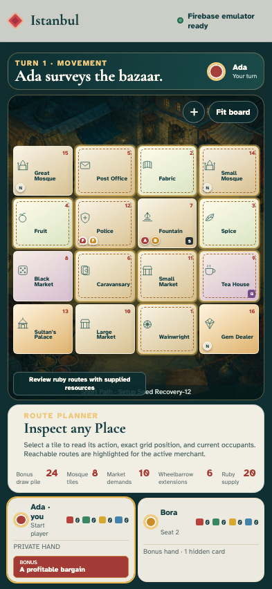

**Verifications:**

- [x] Ada’s phone renders all sixteen Places and her private hand
- [x] The seeded fifth event begins Ada’s movement phase

## 15. The tabletop opens the public bazaar projection

**The public table display** — The tabletop opens the public bazaar projection

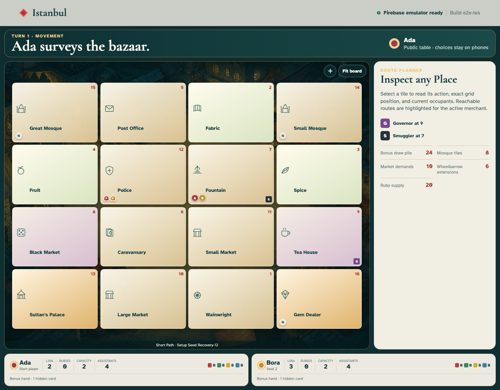

**Verifications:**

- [x] The large surface shows sixteen Places and identifies itself as public
- [x] No private hand or Bonus title is exposed in public DOM or state

## 16. Ada inspects a reachable route on her phone

**Ada, seat-one phone** — Ada inspects a reachable route on her phone

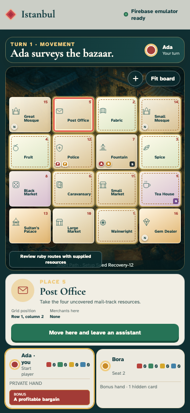

**Verifications:**

- [x] The selected Place is pressed and its movement action is enabled
- [x] Inspection is local UI state and event five remains canonical

## 17. Ada commits the selected move from her controller

**Ada, seat-one phone** — Ada commits the selected move from her controller

**Verifications:**

- [x] Ada’s controller advances from movement into a Place action
- [x] Event six records Ada away from Fountain

## 18. The public table mirrors Ada’s committed movement

**The public table display** — The public table mirrors Ada’s committed movement

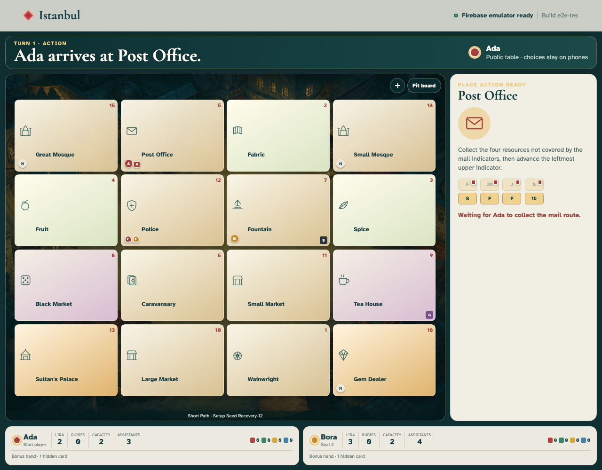

**Verifications:**

- [x] Ada’s token has left Fountain on the large board
- [x] Public and controller cursors agree while private state stays masked
- [x] The route originated from the phone selection: 5 Post Office. Take the four uncovered mail-track resources. Reachable this turn.

## 19. Ada reloads and reclaims her owned controller

**Ada, seat-one phone** — Ada reloads and reclaims her owned controller

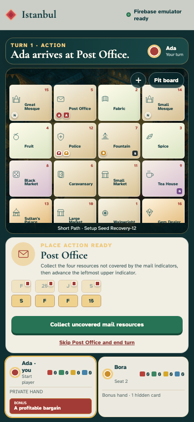

**Verifications:**

- [x] Anonymous-auth persistence returns Ada directly to her game, not the join screen
- [x] Seat ownership, private hand, and six-event cursor survive reconnect
