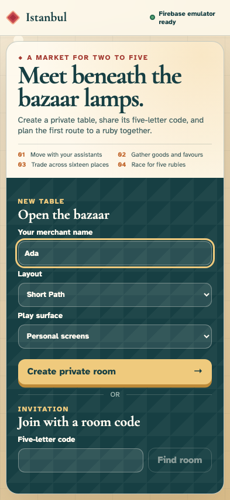
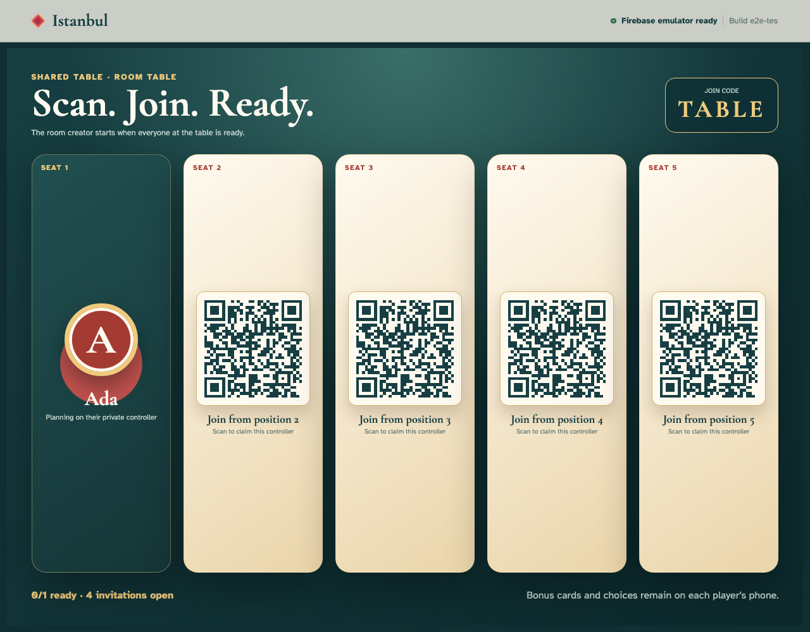
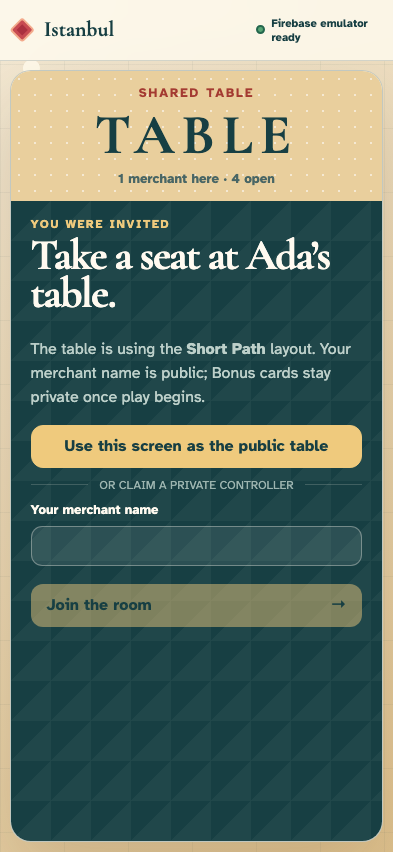
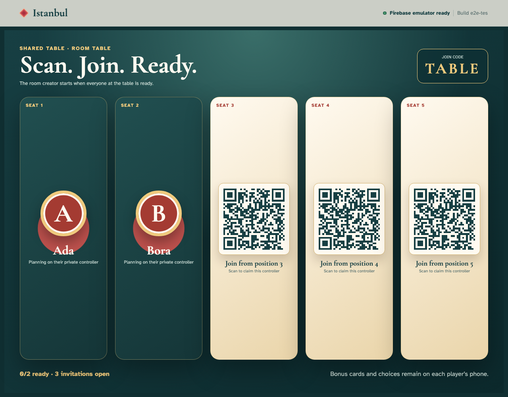
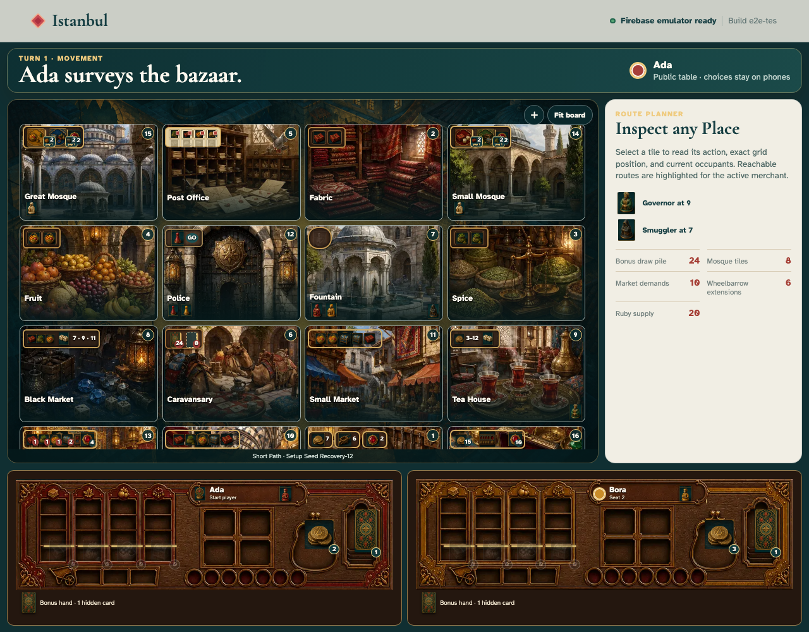
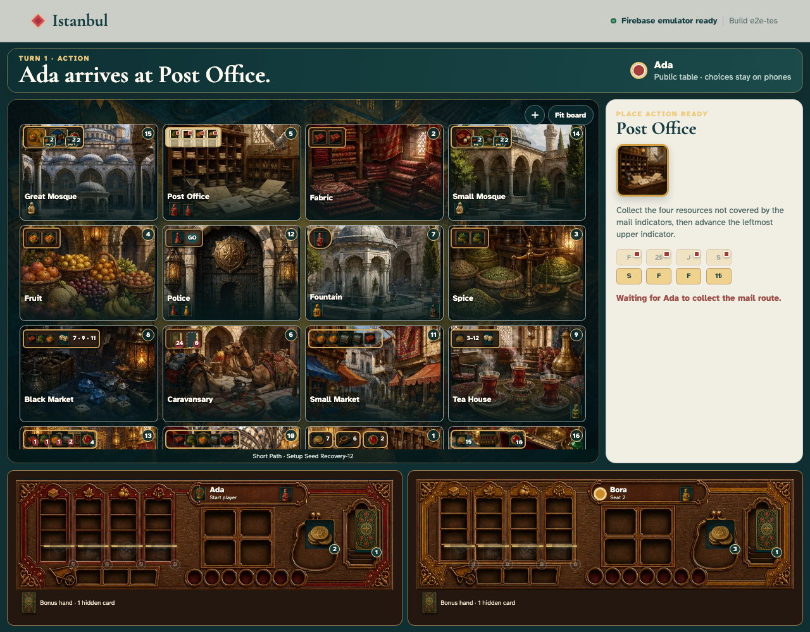

# A shared Istanbul table with private phone controllers

Ada creates an open shared-table room without predicting attendance. The public tabletop shows a real QR at every open position; Bora follows one on his private phone, joins, and readies. Once everyone present is ready, Ada starts the game and every invitation disappears in favour of the public bazaar. The public board follows the immutable game without revealing either Bonus hand; a controller action and reload prove convergence and retained ownership. Every user action is followed immediately by DOM and serialized-state checks plus an exact screenshot—including the 3840×2160 tabletop surface.

## 1. Ada opens the table creator on her phone

**Ada, seat-one phone** — Ada opens the table creator on her phone

**Verifications:**

- [x] Firebase is ready and no room exists yet
- [x] Both personal-screen and shared-table surfaces are available

## 2. Ada enters her public merchant name

**Ada, seat-one phone** — Ada enters her public merchant name

**Verifications:**

- [x] The creator retains Ada’s name without writing history

## 3. Ada reviews an open shared-table room

**Ada, seat-one phone** — Ada reviews an open shared-table room

**Verifications:**

- [x] Short Path is visible and no player count is requested
- [x] Reviewing the open-room form is still local

## 4. Ada selects a shared table with private phones

**Ada, seat-one phone** — Ada selects a shared table with private phones

**Verifications:**

- [x] The submit action now promises a shared table
- [x] Surface selection has not appended an event

## 5. Ada creates shared table TABLE

**Ada, seat-one phone** — Ada creates shared table TABLE

**Verifications:**

- [x] Ada owns the first position and sees a real general invitation
- [x] The first canonical event records shared-table mode and open capacity

## 6. The central screen opens the public tabletop route

**The public table display** — The central screen opens the public tabletop route

**Verifications:**

- [x] The tabletop shows the room code and a QR in every open position
- [x] The dedicated URL enters display mode without claiming a player identity
- [x] Every QR carries the same open-room invitation

## 7. Bora scans a tabletop QR invitation on his phone

**Bora, seat-two phone** — Bora scans a tabletop QR invitation on his phone

**Verifications:**

- [x] The open invitation identifies Ada’s table without reserving a numbered seat
- [x] Bora is unseated while the creation event replays

## 8. Bora enters his public merchant name

**Bora, seat-two phone** — Bora enters his public merchant name

**Verifications:**

- [x] Bora’s private controller retains the entered name
- [x] No event is written until Bora claims the seat

## 9. Bora claims seat two from his phone

**Bora, seat-two phone** — Bora claims seat two from his phone

**Verifications:**

- [x] Bora’s phone labels seat two as his
- [x] The join is the second canonical event

## 10. The public table mirrors both claimed controllers

**The public table display** — The public table mirrors both claimed controllers

**Verifications:**

- [x] Ada and Bora occupy two positions while three QR invitations remain
- [x] The public display replays the same two events without claiming a seat

## 11. Bora readies from his private controller

**Bora, seat-two phone** — Bora readies from his private controller

**Verifications:**

- [x] Bora sees one of two merchants ready
- [x] Only seat two is ready in event three

## 12. Ada readies and unlocks start on her phone

**Ada, seat-one phone** — Ada readies and unlocks start on her phone

**Verifications:**

- [x] Ada sees Table ready and an enabled opening action
- [x] Both seats are ready after four events

## 13. Ada starts the bazaar from seat one

**Ada, seat-one phone** — Ada starts the bazaar from seat one

**Verifications:**

- [x] Ada’s phone renders all sixteen Places and her private hand
- [x] The seeded fifth event begins Ada’s movement phase

## 14. The tabletop opens the public bazaar projection

**The public table display** — The tabletop opens the public bazaar projection

**Verifications:**

- [x] The large surface shows sixteen Places and identifies itself as public
- [x] Starting play removes every empty position and QR invitation
- [x] No private hand or Bonus title is exposed in public DOM or state

## 15. Ada inspects a reachable route on her phone

**Ada, seat-one phone** — Ada inspects a reachable route on her phone

**Verifications:**

- [x] The selected Place is pressed and its movement action is enabled
- [x] Inspection is local UI state and event five remains canonical

## 16. Ada commits the selected move from her controller

**Ada, seat-one phone** — Ada commits the selected move from her controller

**Verifications:**

- [x] Ada’s controller advances from movement into a Place action
- [x] Event six records Ada away from Fountain

## 17. The public table mirrors Ada’s committed movement

**The public table display** — The public table mirrors Ada’s committed movement

**Verifications:**

- [x] Ada’s token has left Fountain on the large board
- [x] Public and controller cursors agree while private state stays masked
- [x] The route originated from the phone selection: 5 Post Office. Take the four uncovered mail-track resources. Current state: Exposed mail: 1 spice, 1 fabric, 1 fruit, 1 Lira. Reachable this turn.

## 18. Ada reloads and reclaims her owned controller

**Ada, seat-one phone** — Ada reloads and reclaims her owned controller

**Verifications:**

- [x] Anonymous-auth persistence returns Ada directly to her game, not the join screen
- [x] Seat ownership, private hand, and six-event cursor survive reconnect
