# A complete Istanbul surface at every accessible viewport

Ada and Bora create a real two-player game at phone portrait, phone landscape, tablet, and desktop dimensions. Ada then traverses the 4×4 bazaar with arrow keys, transfers focus into the selected Place inspector with Enter, and commits movement through a touch-sized action. Each action is followed by an exact screenshot plus checks of the immutable projection, semantic board, focus location, live announcement, contrast, non-colour labels, safe-area padding, reduced motion, 44 px target size, and zero viewport overflow.

## 1. Ada opens the private-table creator

**Ada, keyboard and touch player** — Ada opens the private-table creator

**Verifications:**

- [x] Firebase reports ready before setup begins
- [x] The landing projection is empty

## 2. Ada enters the first merchant name

**Ada, keyboard and touch player** — Ada enters the first merchant name

**Verifications:**

- [x] Ada remains visible in the public-name field
- [x] Typing has not appended an event

## 3. Ada reviews the open-room setup

**Ada, keyboard and touch player** — Ada reviews the open-room setup

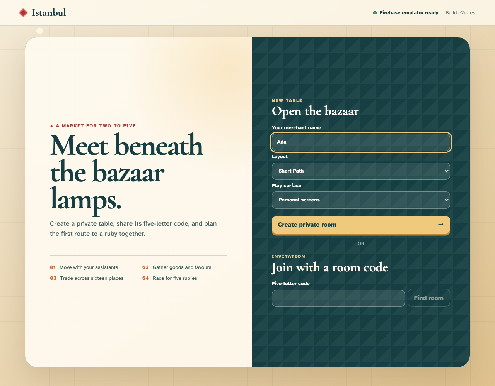

**Verifications:**

- [x] Short Path is visible and no player count is requested
- [x] Reviewing the open-room setup still has no immutable history

## 4. Ada creates private room AIDES

**Ada, keyboard and touch player** — Ada creates private room AIDES

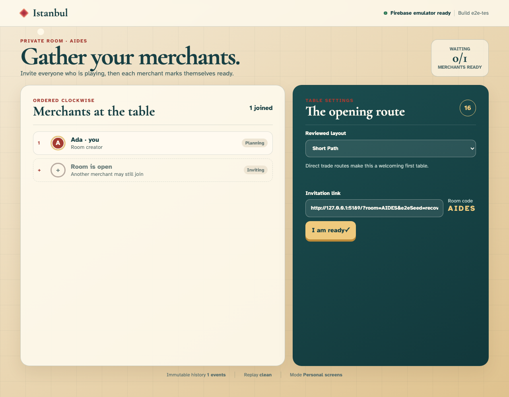

**Verifications:**

- [x] Ada is the room creator and the room remains open
- [x] One creation event projects a five-player-capacity lobby

## 5. Bora follows Ada’s room invitation

**Bora, second merchant** — Bora follows Ada’s room invitation

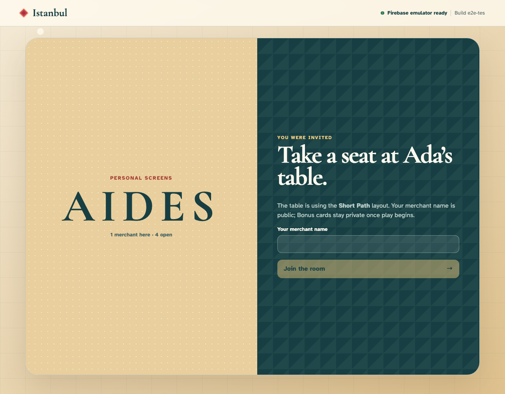

**Verifications:**

- [x] Ada and Short Path identify the invited table
- [x] Bora observes exactly the creation event

## 6. Bora enters the second merchant name

**Bora, second merchant** — Bora enters the second merchant name

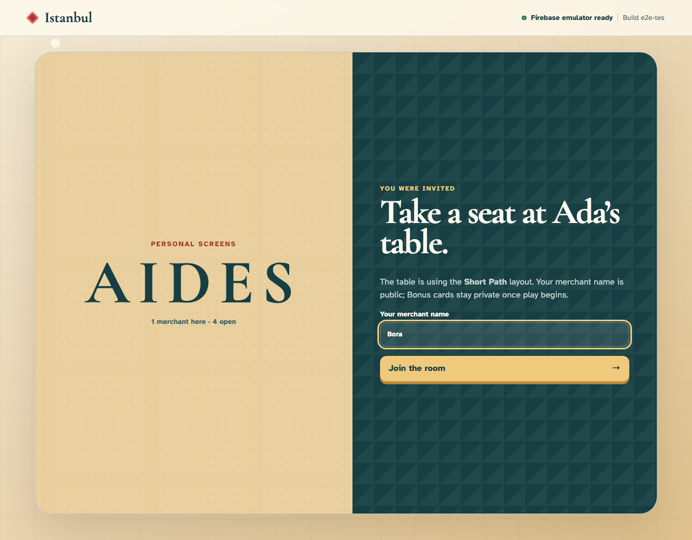

**Verifications:**

- [x] Bora remains visible in the join field
- [x] Join is enabled and history is unchanged

## 7. Bora claims clockwise seat two

**Bora, second merchant** — Bora claims clockwise seat two

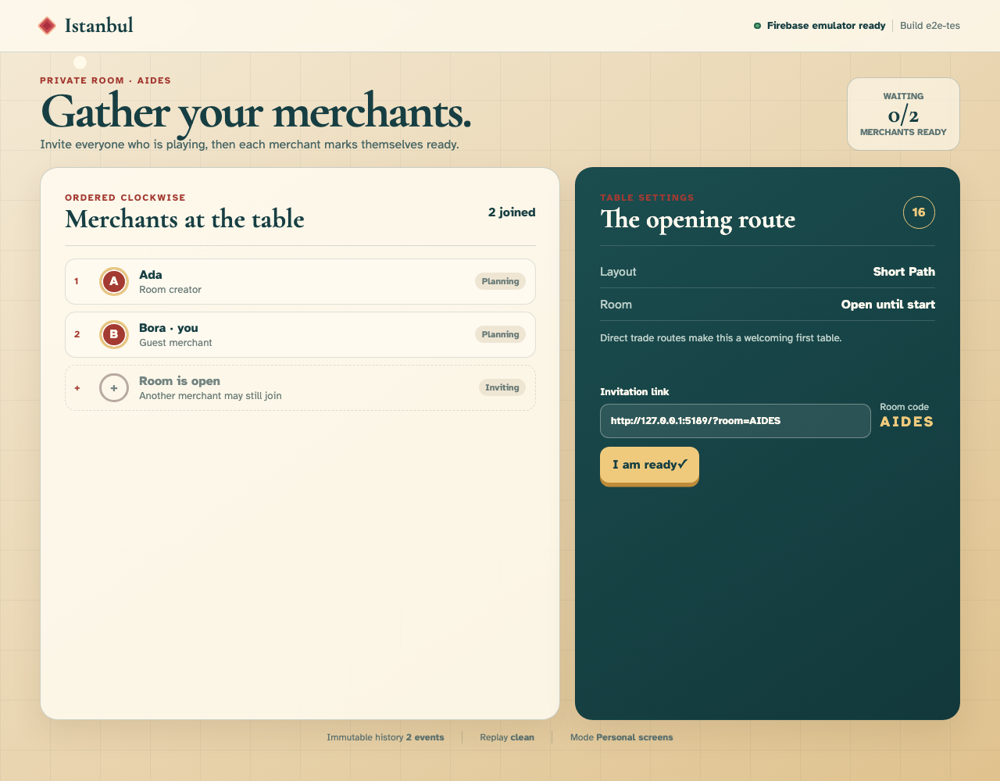

**Verifications:**

- [x] Both named seats appear in order
- [x] The join is event two with neither merchant ready

## 8. Bora readies for the reviewed layout

**Bora, second merchant** — Bora readies for the reviewed layout

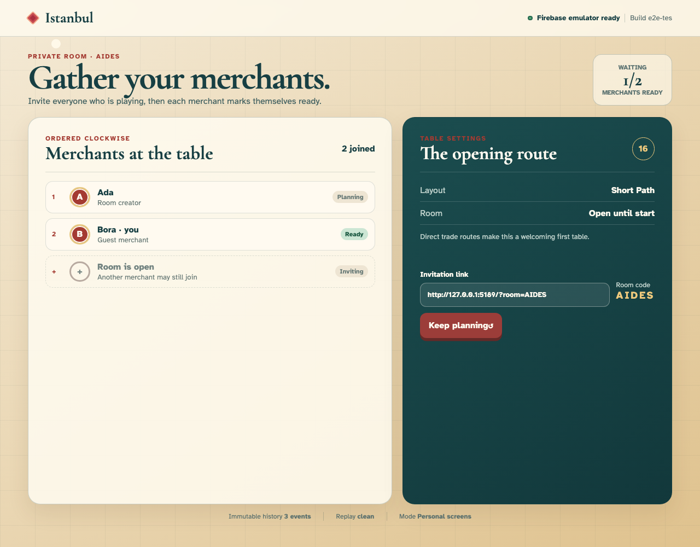

**Verifications:**

- [x] The table shows one of two merchants ready
- [x] Only Bora is ready in event three

## 9. Ada readies and unlocks the bazaar

**Ada, keyboard and touch player** — Ada readies and unlocks the bazaar

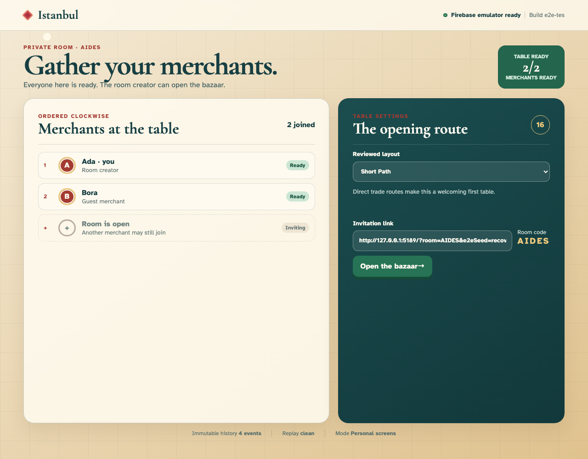

**Verifications:**

- [x] The host sees Table ready and an enabled start button
- [x] Event four has both merchants ready and no setup yet

## 10. Ada commits the seed and opens the bazaar

**Ada, keyboard and touch player** — Ada commits the seed and opens the bazaar

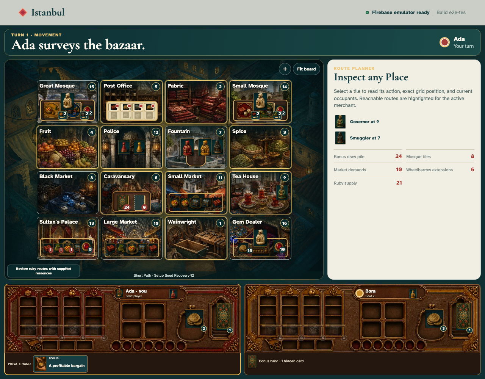

**Verifications:**

- [x] All sixteen Place controls are rendered
- [x] Ada is the seeded first merchant at Fountain

## 11. Ada moves keyboard focus onto the bazaar

**Ada, keyboard and touch player** — Ada moves keyboard focus onto the bazaar

**Verifications:**

- [x] Exactly one Place is in the board tab stop
- [x] The focused Place exposes number, name, action, reachability, and occupants in its label
- [x] The semantic board contains sixteen button controls

## 12. Ada presses Arrow Right to traverse the grid

**Ada, keyboard and touch player** — Ada presses Arrow Right to traverse the grid

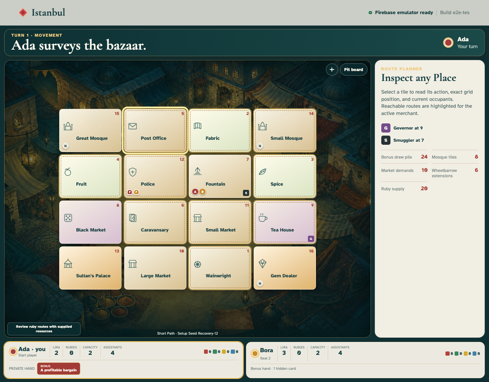

**Verifications:**

- [x] Focus and the sole roving tab stop move to the next column
- [x] Arrow navigation changes no event or selected Place

## 13. Ada positions focus beside a highlighted route

**Ada, keyboard and touch player** — Ada positions focus beside a highlighted route

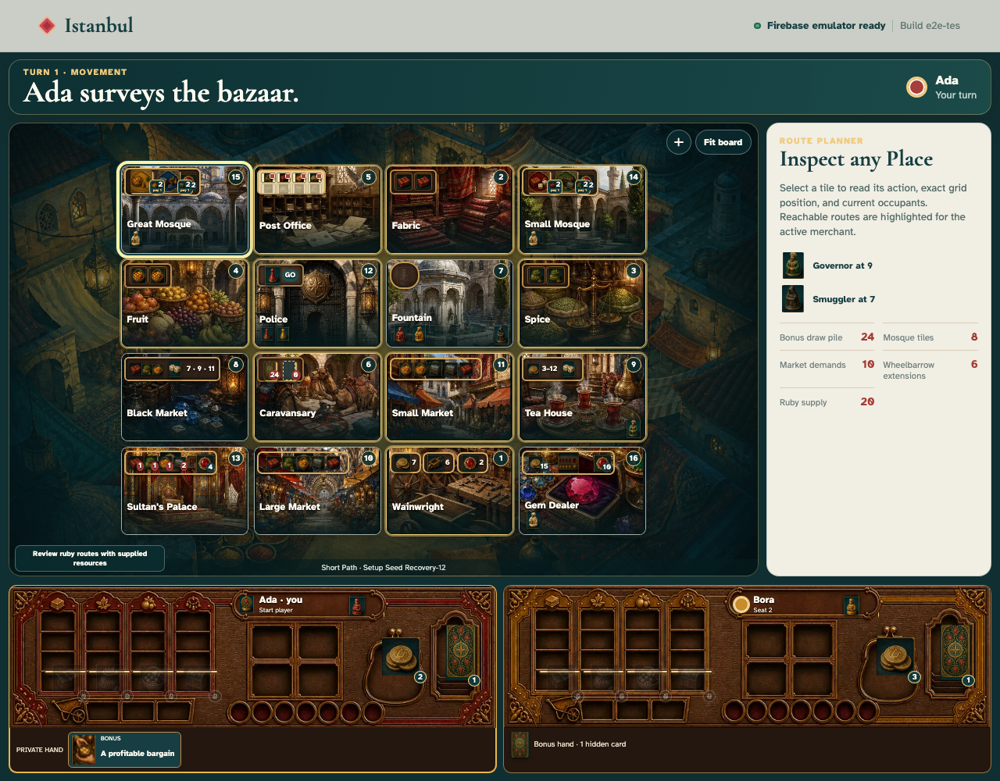

**Verifications:**

- [x] The neighbouring Place receives visible keyboard focus
- [x] The destination says Reachable this turn without relying on colour

## 14. Ada arrows onto the reachable destination

**Ada, keyboard and touch player** — Ada arrows onto the reachable destination

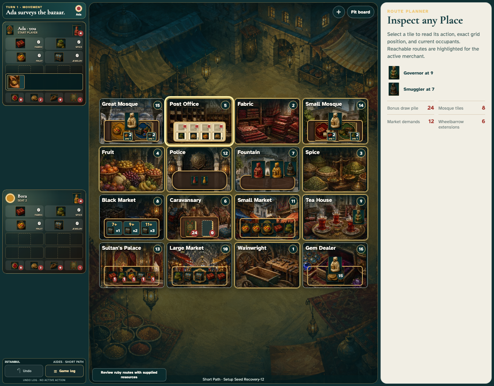

**Verifications:**

- [x] Focus lands on the intended reachable Place
- [x] Keyboard traversal remains local at event five

## 15. Ada presses Enter and focus transfers into the Place inspector

**Ada, keyboard and touch player** — Ada presses Enter and focus transfers into the Place inspector

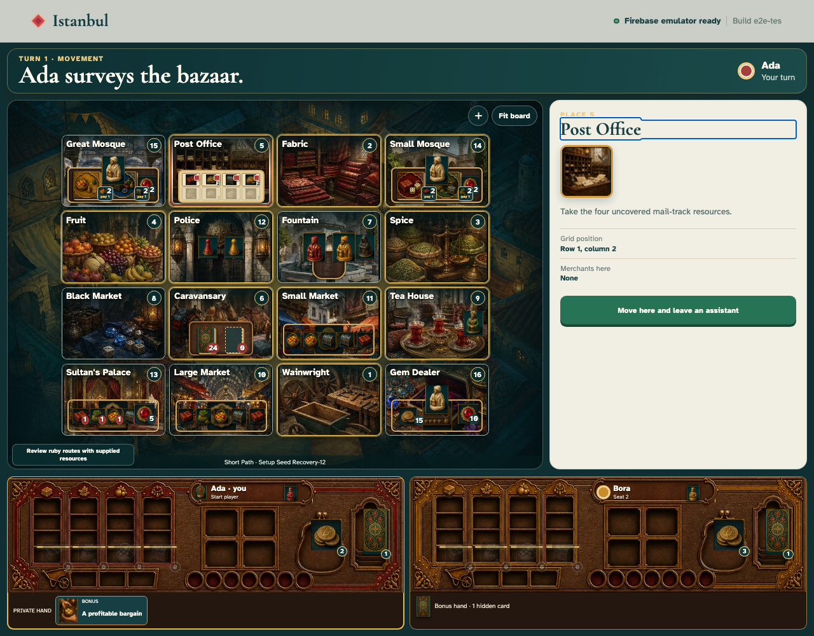

**Verifications:**

- [x] The Place inspector heading receives focus for immediate reading
- [x] The chosen Place is selected locally while history remains at five events
- [x] The movement action is enabled and names the assistant consequence

## 16. Ada taps the full-size movement action

**Ada, keyboard and touch player** — Ada taps the full-size movement action

**Verifications:**

- [x] The action target is at least 44 by 44 CSS pixels
- [x] Event six commits Ada’s destination and advances to its action
- [x] Reduced-motion preference suppresses movement animation

## 17. Ada receives the updated turn through every information channel

**Ada, keyboard and touch player** — Ada receives the updated turn through every information channel

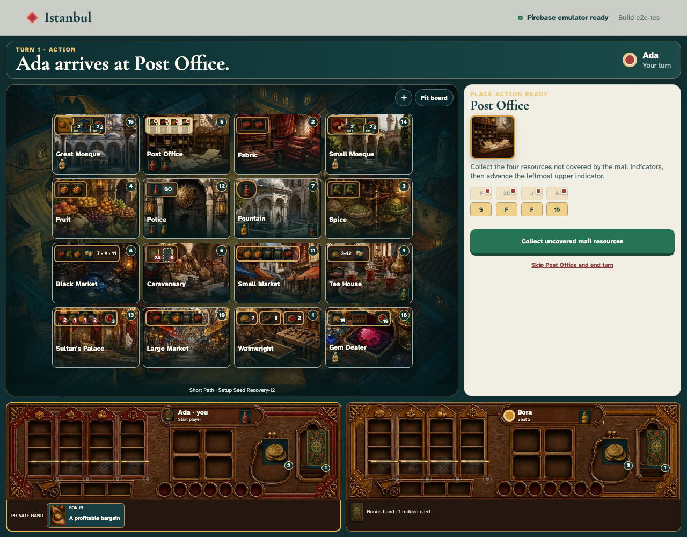

**Verifications:**

- [x] The live region announces turn, merchant, phase, and ownership
- [x] Goods and merchant pieces retain textual labels beyond colour
- [x] Turn heading colours meet WCAG AA contrast
- [x] Safe-area-aware padding is present on every edge
- [x] Canonical projection remains clean after accessible input
