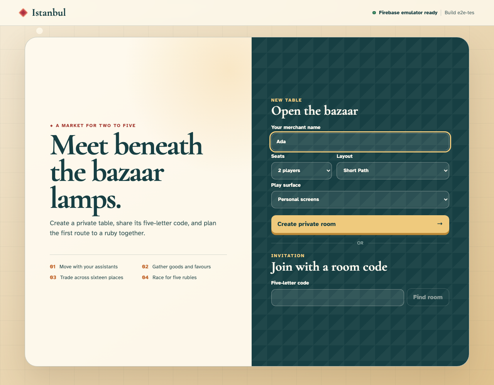
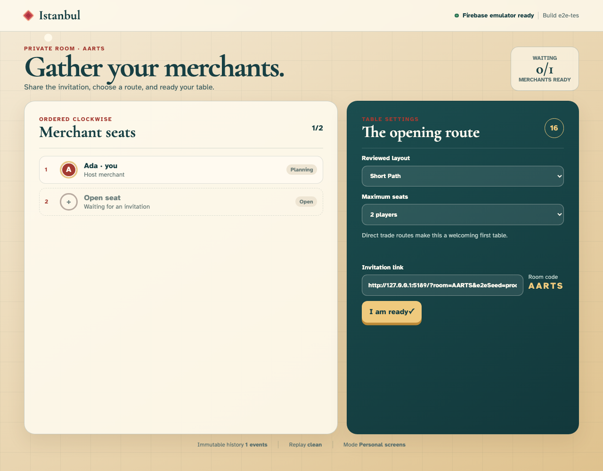
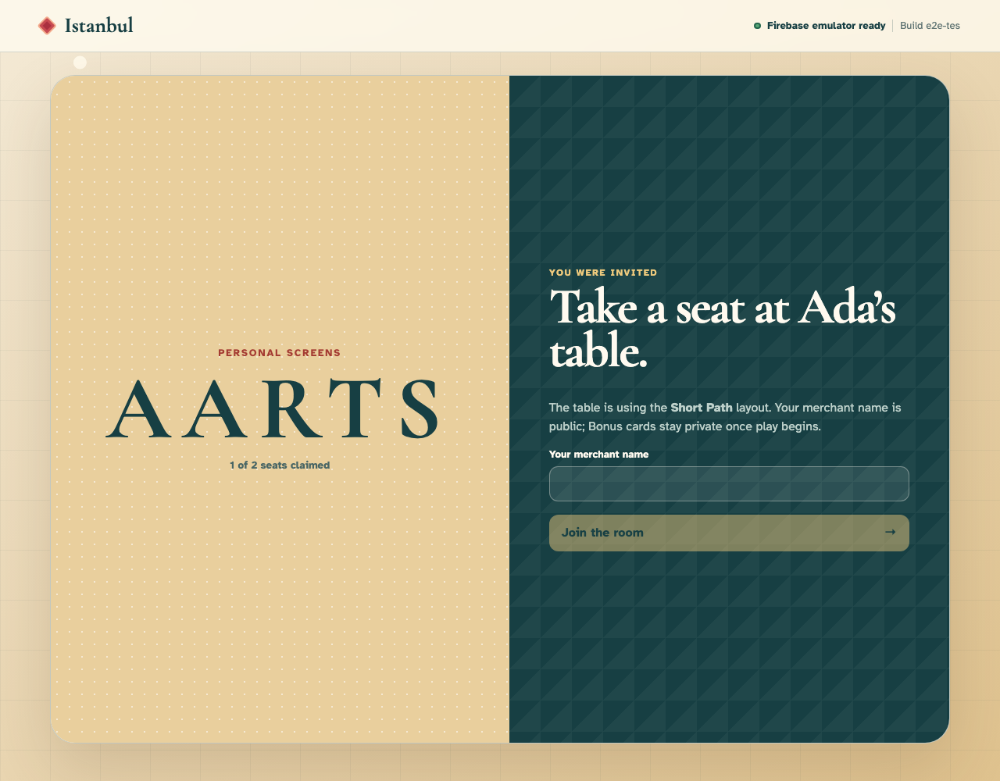
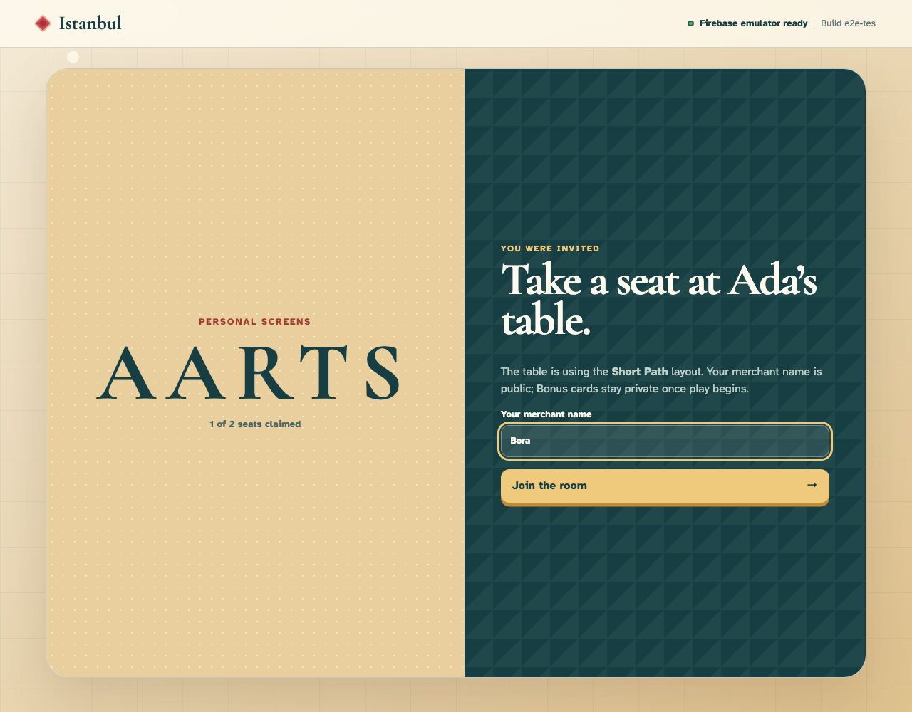
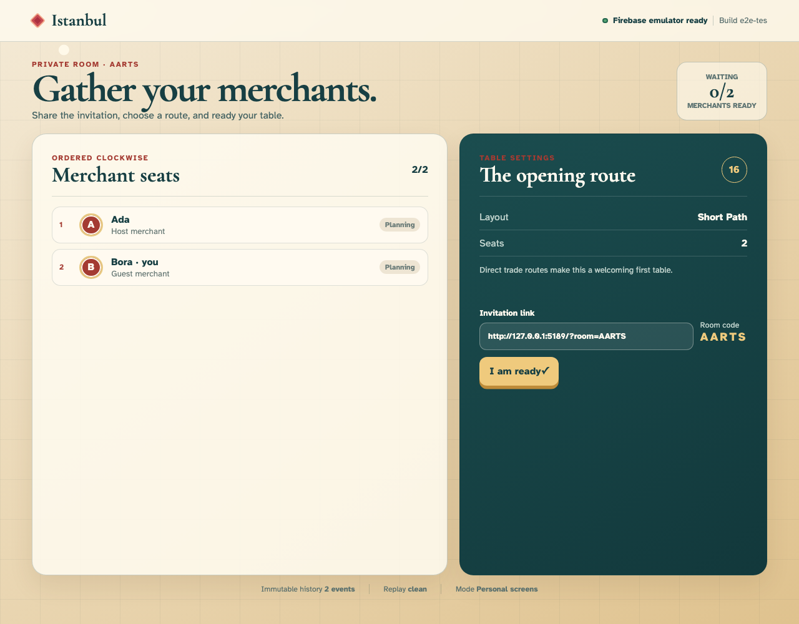
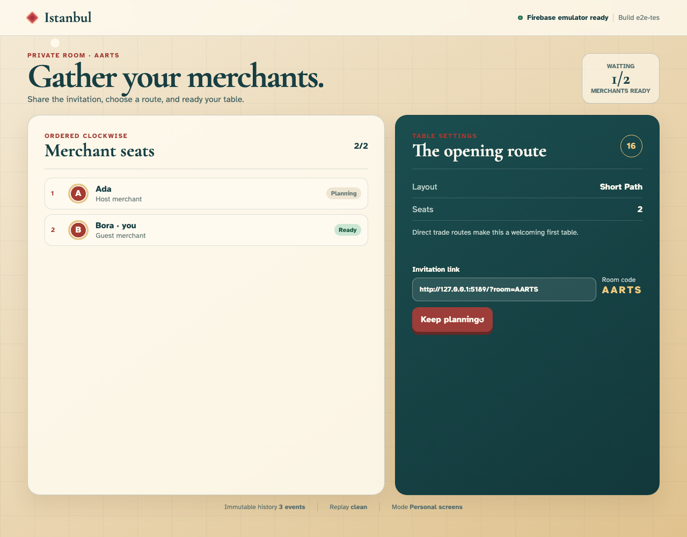
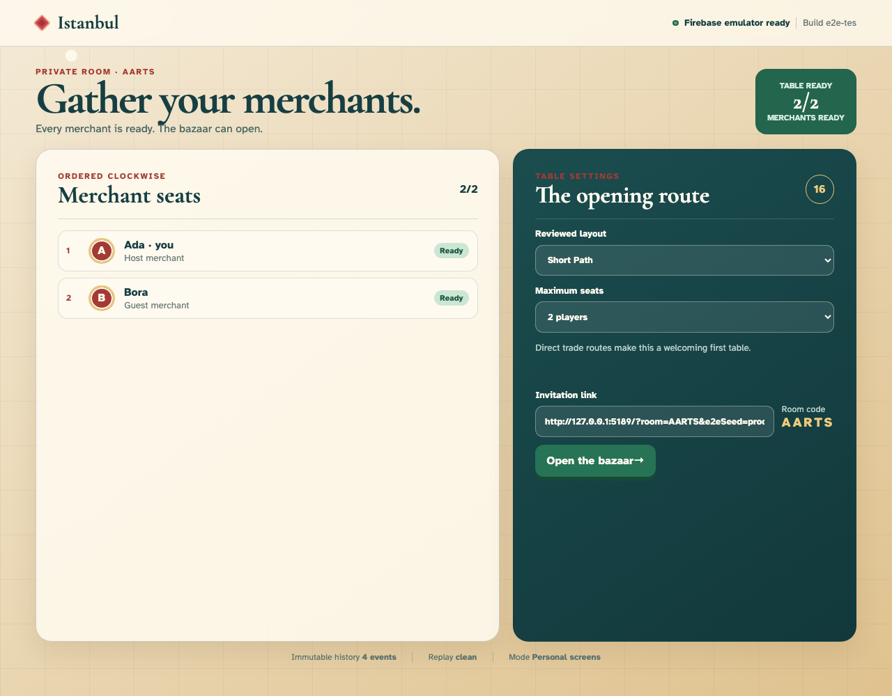
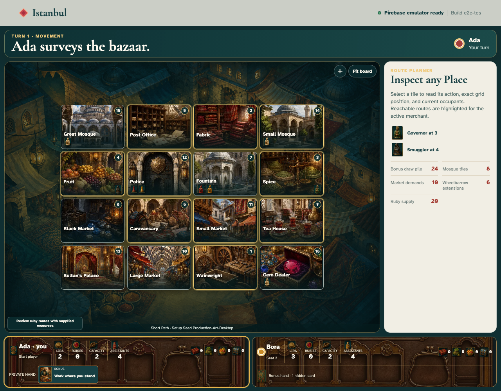
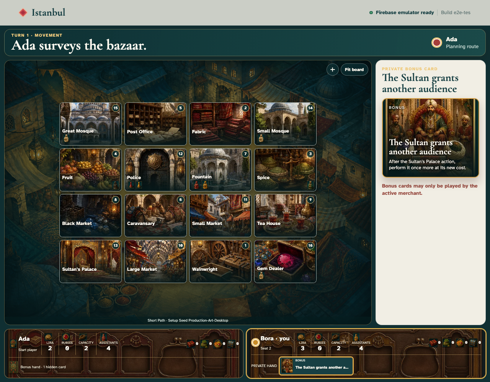

# Playing Istanbul with original production artwork

Ada and Bora create a real two-player game through the ordinary room controls. When the seeded bazaar opens, every location, merchant, assistant, encounter, good, ruby, Bonus card, and player mat is backed by an original graphical asset while its exact rules state remains available through the DOM and serialized replay projection. Bora then opens his private card to compare its hand thumbnail with the full illustrated face.

## 1. Ada opens the private-table creator

**Ada, the host** — Ada opens the private-table creator

**Verifications:**

- [x] Firebase reports ready before setup begins
- [x] The landing projection is empty

## 2. Ada enters the first merchant name

**Ada, the host** — Ada enters the first merchant name

**Verifications:**

- [x] Ada remains visible in the public-name field
- [x] Typing has not appended an event

## 3. Ada chooses a two-player Short Path table

**Ada, the host** — Ada chooses a two-player Short Path table

**Verifications:**

- [x] Two players and Short Path are the visible form values
- [x] Draft configuration still has no immutable history

## 4. Ada creates private room AARTS

**Ada, the host** — Ada creates private room AARTS

**Verifications:**

- [x] Ada owns seat one of two
- [x] One creation event projects the lobby

## 5. Bora follows Ada’s room invitation

**Bora, the second merchant** — Bora follows Ada’s room invitation

**Verifications:**

- [x] Ada and Short Path identify the invited table
- [x] Bora observes exactly the creation event

## 6. Bora enters the second merchant name

**Bora, the second merchant** — Bora enters the second merchant name

**Verifications:**

- [x] Bora remains visible in the join field
- [x] Join is enabled and history is unchanged

## 7. Bora claims clockwise seat two

**Bora, the second merchant** — Bora claims clockwise seat two

**Verifications:**

- [x] Both named seats appear in order
- [x] The join is event two with neither merchant ready

## 8. Bora readies for the reviewed layout

**Bora, the second merchant** — Bora readies for the reviewed layout

**Verifications:**

- [x] The table shows one of two merchants ready
- [x] Only Bora is ready in event three

## 9. Ada readies and unlocks the bazaar

**Ada, the host** — Ada readies and unlocks the bazaar

**Verifications:**

- [x] The host sees Table ready and an enabled start button
- [x] Event four has both merchants ready and no setup yet

## 10. Ada commits the seed and opens the bazaar

**Ada, the host** — Ada commits the seed and opens the bazaar

**Verifications:**

- [x] All sixteen Place controls are rendered
- [x] Ada is the seeded first merchant at Fountain

## 11. Ada reviews the complete illustrated tabletop

**Ada, the host** — Ada reviews the complete illustrated tabletop

**Verifications:**

- [x] All sixteen Place buttons contain loaded location artwork
- [x] The board uses graphical merchant, assistant, Governor, and Smuggler pieces
- [x] Both colour-keyed player mats and every resource icon are real loaded images
- [x] The canonical setup remains unchanged by its visual treatment

## 12. Bora opens his illustrated private Bonus card

**Bora, the second merchant** — Bora opens his illustrated private Bonus card

**Verifications:**

- [x] The hand thumbnail and large card face both load production card art
- [x] The exact private title and rules text stay in semantic HTML over the artwork
- [x] Ada’s hand remains a graphical card back with no private face exposed
- [x] Card inspection is local view state and adds no immutable event
