# Substituting goods directly on a Flexible Demand card

Ada and Bora open a normal two-player bazaar. A visible emulator review control gives Ada four matching goods, one substitute, and the real Flexible Demand card. Ada walks to Small Market, sees every matching slot already selected and the useful card prominently offered, plays it in place, fills the one missing demand with her substitute, and commits a complete twenty-Lira sale. Every input is followed by a screenshot and programmatic checks of the controls, immutable event history, goods payment, demand rotation, and consumed Bonus effect.

## 1. Ada opens the private-table creator

**Ada, the first merchant** — Ada opens the private-table creator

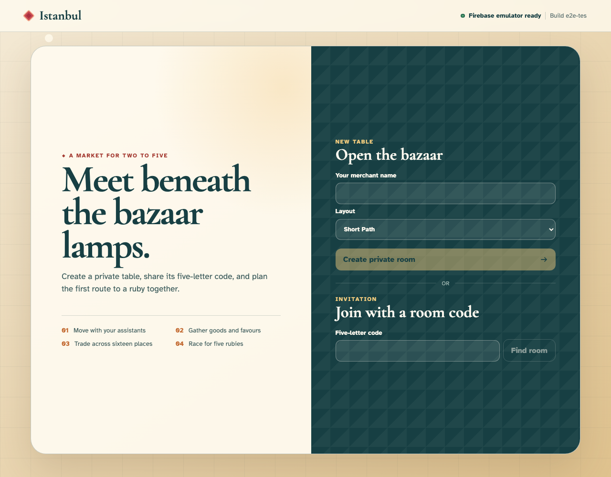

**Verifications:**

- [x] Firebase reports ready before setup begins
- [x] The landing projection is empty

## 2. Ada enters the first merchant name

**Ada, the first merchant** — Ada enters the first merchant name

**Verifications:**

- [x] Ada remains visible in the public-name field
- [x] Typing has not appended an event

## 3. Ada reviews the open-room setup

**Ada, the first merchant** — Ada reviews the open-room setup

**Verifications:**

- [x] Short Path is visible and no player count is requested
- [x] Reviewing the open-room setup still has no immutable history

## 4. Ada creates private room FLXDS

**Ada, the first merchant** — Ada creates private room FLXDS

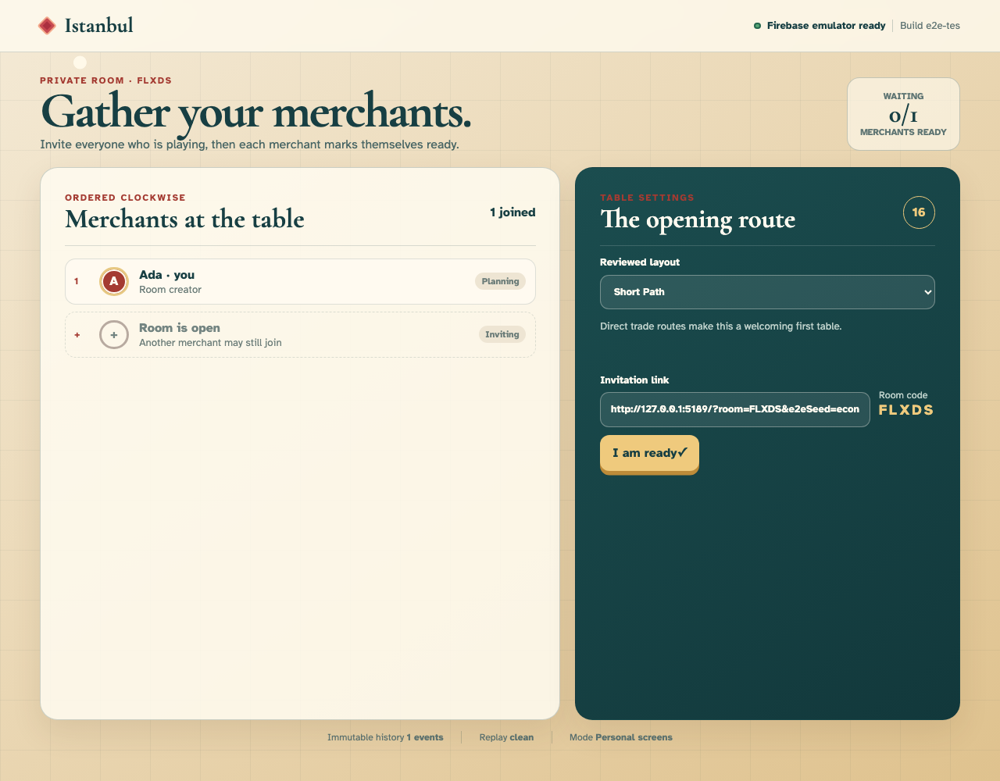

**Verifications:**

- [x] Ada is the room creator and the room remains open
- [x] One creation event projects a five-player-capacity lobby

## 5. Bora follows Ada’s room invitation

**Bora, the second merchant** — Bora follows Ada’s room invitation

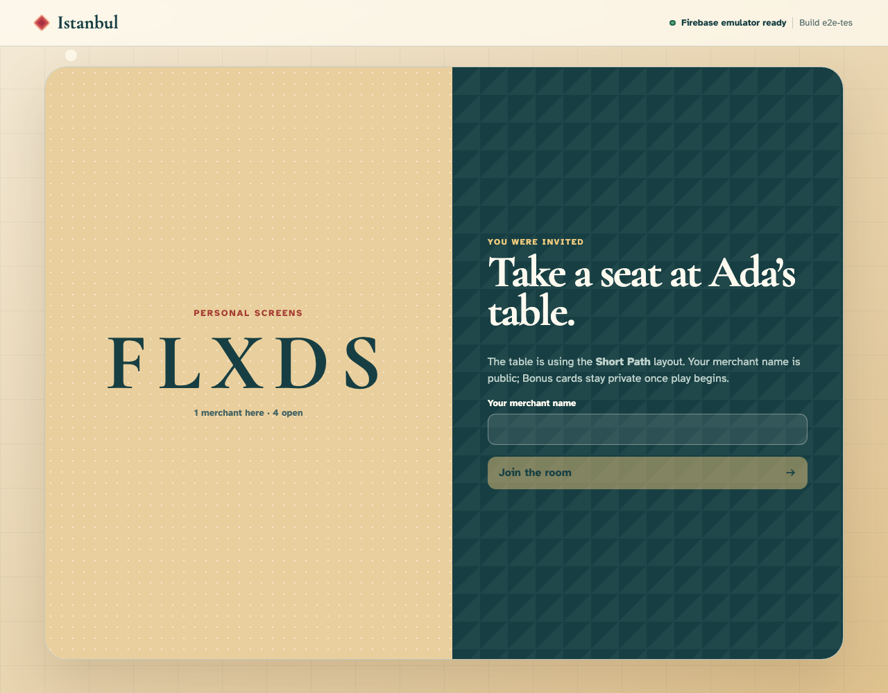

**Verifications:**

- [x] Ada and Short Path identify the invited table
- [x] Bora observes exactly the creation event

## 6. Bora enters the second merchant name

**Bora, the second merchant** — Bora enters the second merchant name

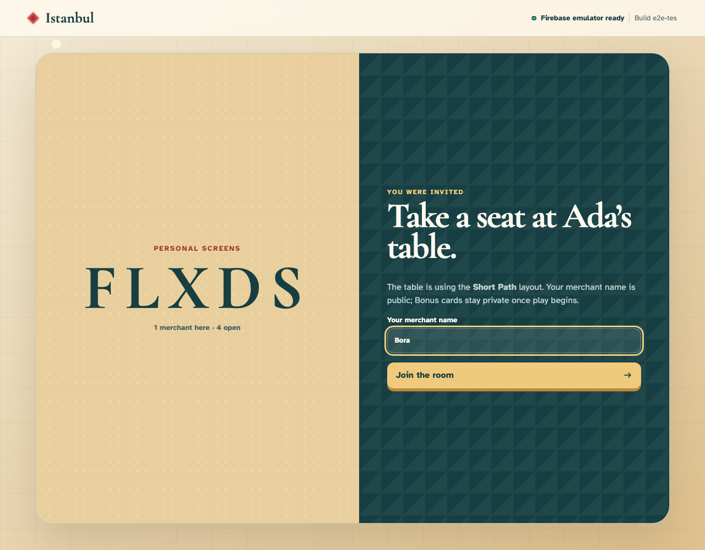

**Verifications:**

- [x] Bora remains visible in the join field
- [x] Join is enabled and history is unchanged

## 7. Bora claims clockwise seat two

**Bora, the second merchant** — Bora claims clockwise seat two

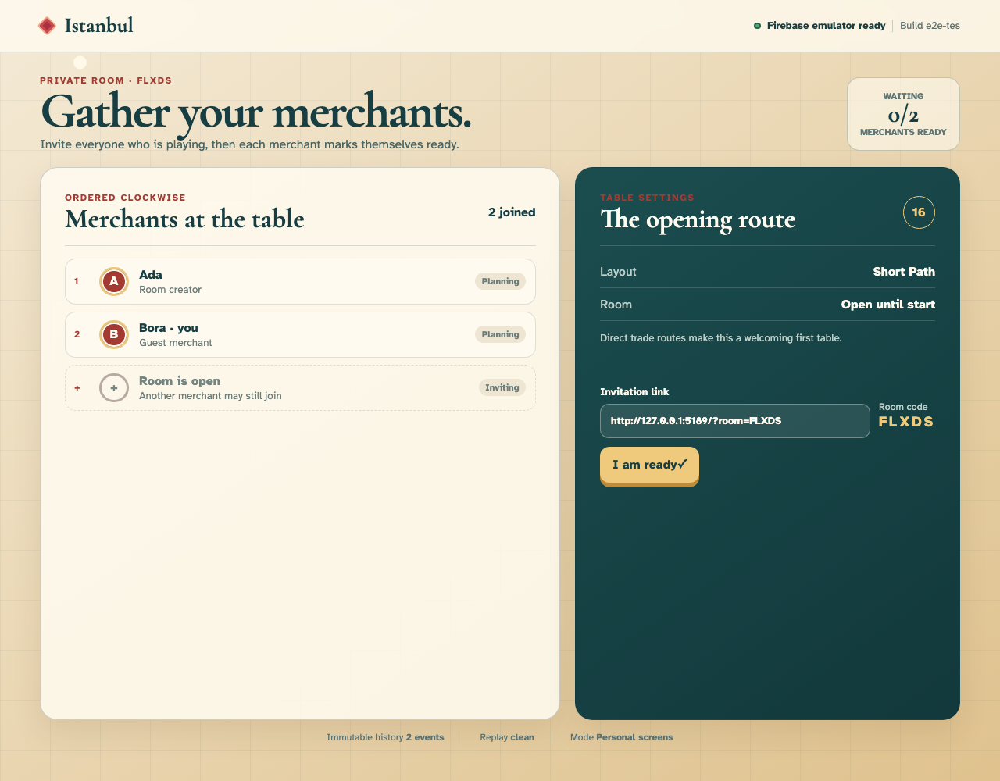

**Verifications:**

- [x] Both named seats appear in order
- [x] The join is event two with neither merchant ready

## 8. Bora readies for the reviewed layout

**Bora, the second merchant** — Bora readies for the reviewed layout

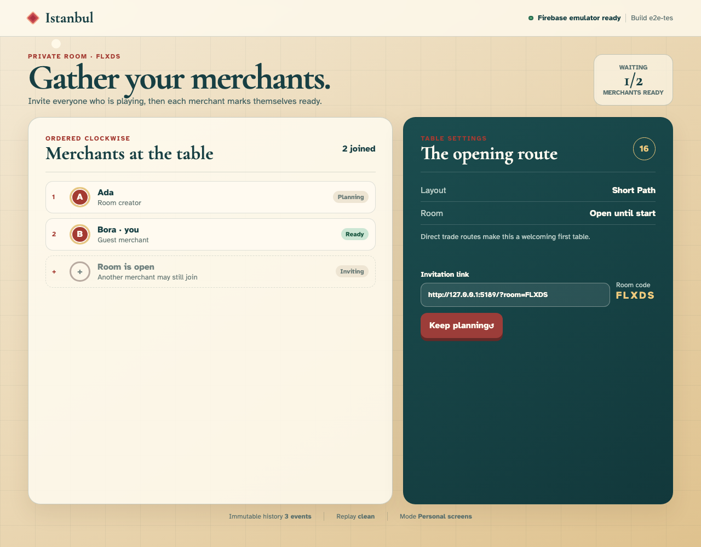

**Verifications:**

- [x] The table shows one of two merchants ready
- [x] Only Bora is ready in event three

## 9. Ada readies and unlocks the bazaar

**Ada, the first merchant** — Ada readies and unlocks the bazaar

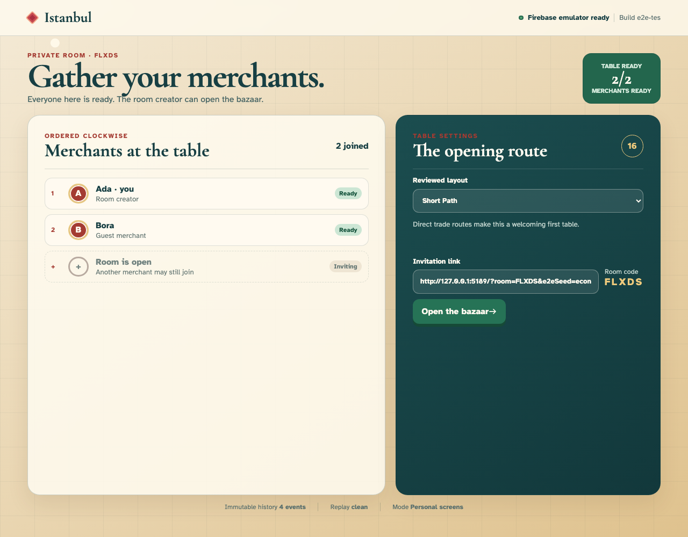

**Verifications:**

- [x] The host sees Table ready and an enabled start button
- [x] Event four has both merchants ready and no setup yet

## 10. Ada commits the seed and opens the bazaar

**Ada, the first merchant** — Ada commits the seed and opens the bazaar

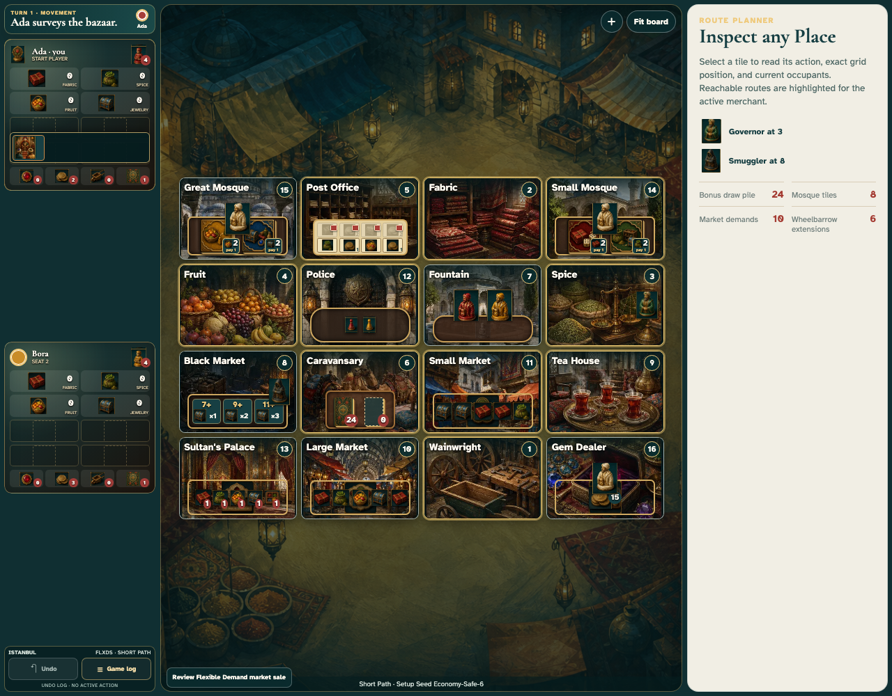

**Verifications:**

- [x] All sixteen Place controls are rendered
- [x] Ada is the seeded first merchant at Fountain

## 11. Ada opens the reviewed Flexible Demand position

**Ada, the first merchant** — Ada opens the reviewed Flexible Demand position

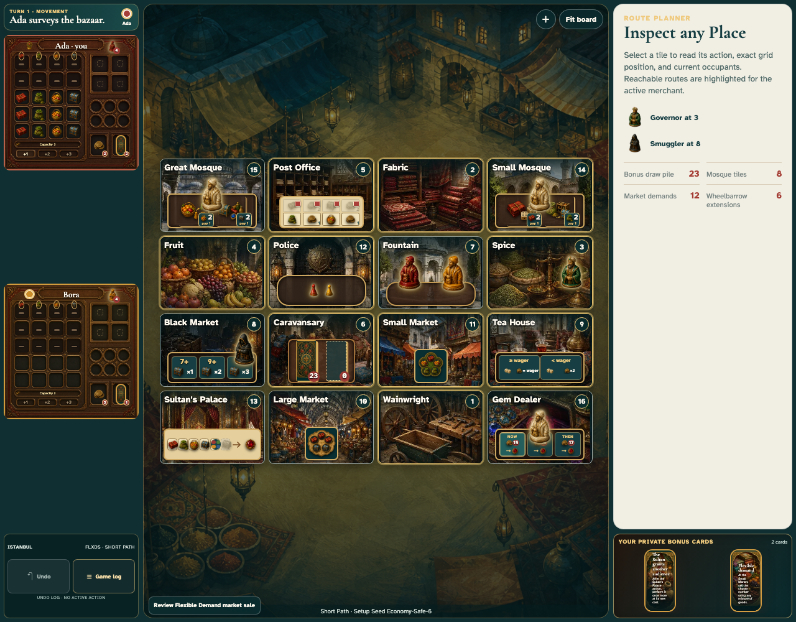

**Verifications:**

- [x] Ada has four exact matches, one substitute, and the real Flexible Demand card
- [x] Bora sees only Ada’s private hand count

## 12. Ada selects the adjacent Small Market

**Ada, the first merchant** — Ada selects the adjacent Small Market

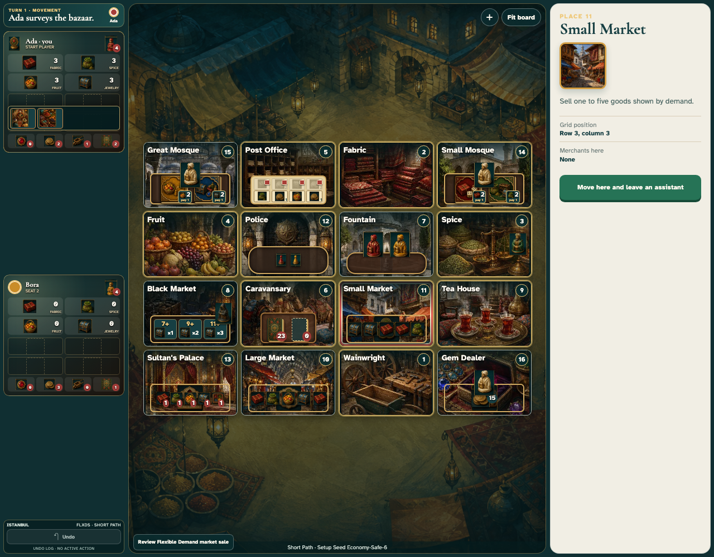

**Verifications:**

- [x] Small Market is selected as a legal one-space route
- [x] The assistant operation is explicit

## 13. Ada arrives at the five-slot demand card

**Ada, the first merchant** — Ada arrives at the five-slot demand card

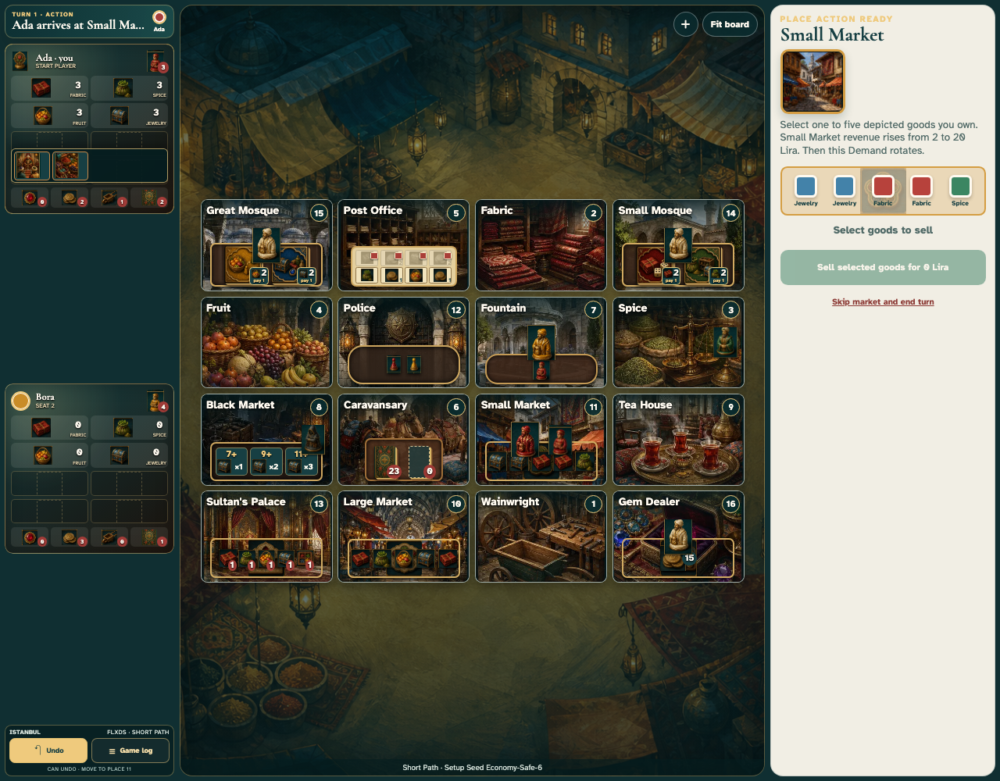

**Verifications:**

- [x] All five ordinary demand slots are selectable before the card is played
- [x] The four demand goods Ada owns are selected by default
- [x] The pending default sale is worth fourteen Lira
- [x] Flexible Demand is pictured prominently beside a direct play button
- [x] No substitution dropdown exists before Flexible Demand is active
- [x] Movement opens the action without rotating demand

## 14. Ada plays the prominent card to enable substitutions

**Ada, the first merchant** — Ada plays the prominent card to enable substitutions

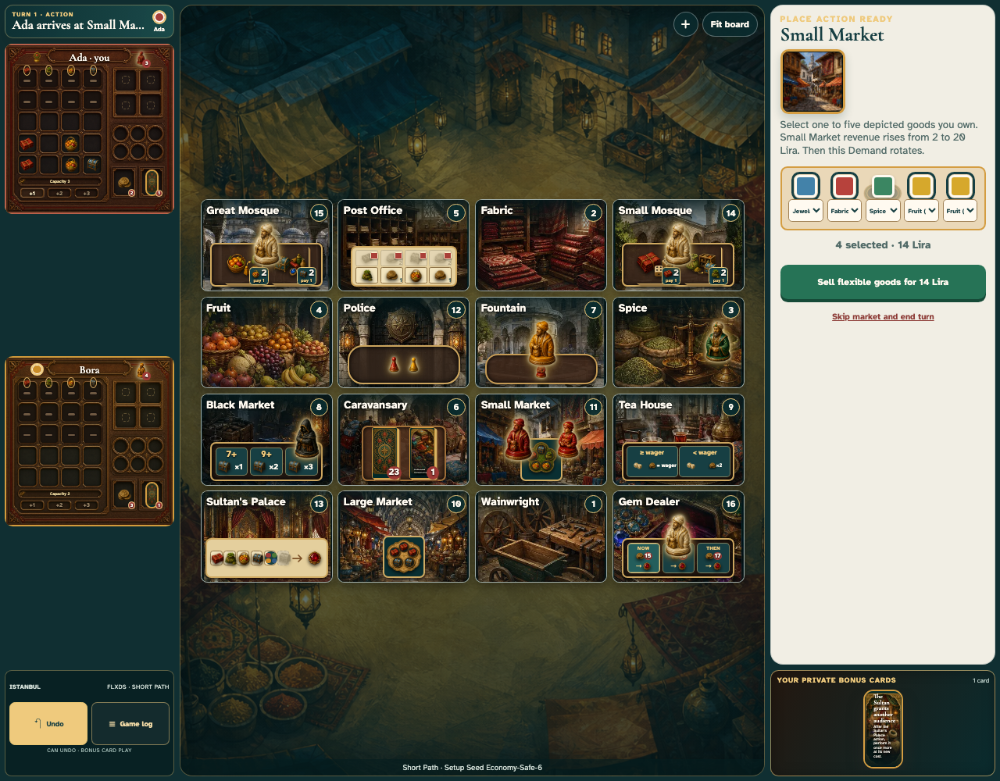

**Verifications:**

- [x] Each printed market good is now paired with its own payment dropdown
- [x] Every dropdown defaults to the good printed in that slot
- [x] The four affordable printed slots remain selected
- [x] The Bonus event activates Flexible Demand without selling anything

## 15. Ada substitutes her extra fabric for the missing spice

**Ada, the first merchant** — Ada substitutes her extra fabric for the missing spice

**Verifications:**

- [x] The missing spice slot now names fabric as payment
- [x] Changing a local payment choice writes no canonical event

## 16. Ada adds the substituted fifth slot to the sale

**Ada, the first merchant** — Ada adds the substituted fifth slot to the sale

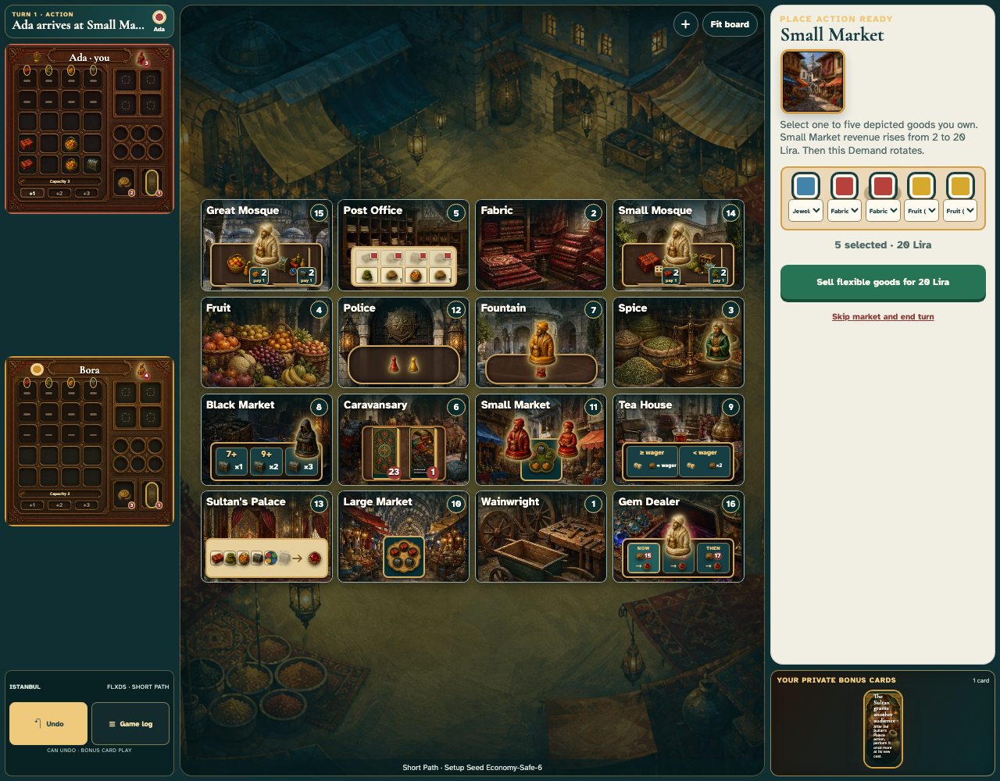

**Verifications:**

- [x] All five demand slots are visibly selected
- [x] The complete Small Market sale is worth twenty Lira
- [x] The flexible sale is legal with exactly Ada’s five goods

## 17. Ada pays every good for the complete twenty-Lira sale

**Ada, the first merchant** — Ada pays every good for the complete twenty-Lira sale

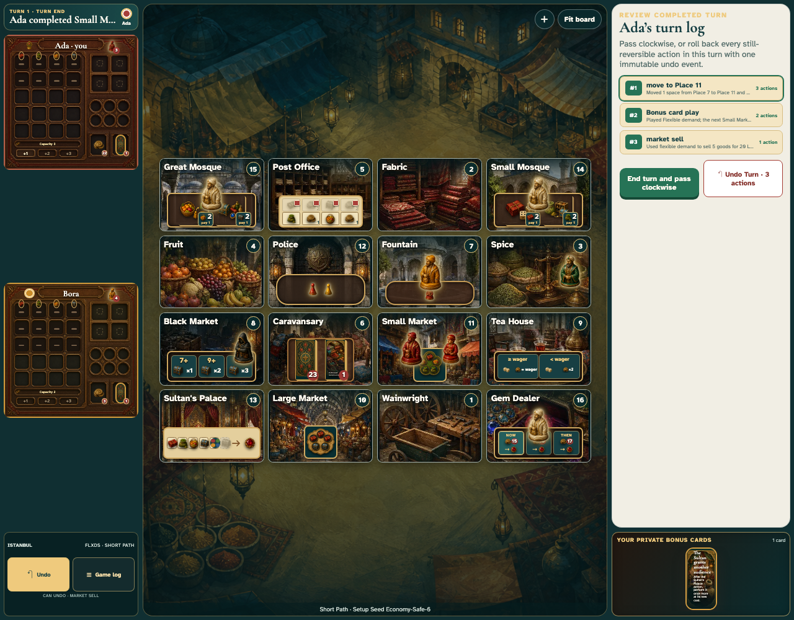

**Verifications:**

- [x] Exactly two fabric, two fruit, and one jewelry are paid
- [x] The completion record identifies a five-good flexible sale
- [x] The five-slot editor closes after the consumed effect rotates demand
